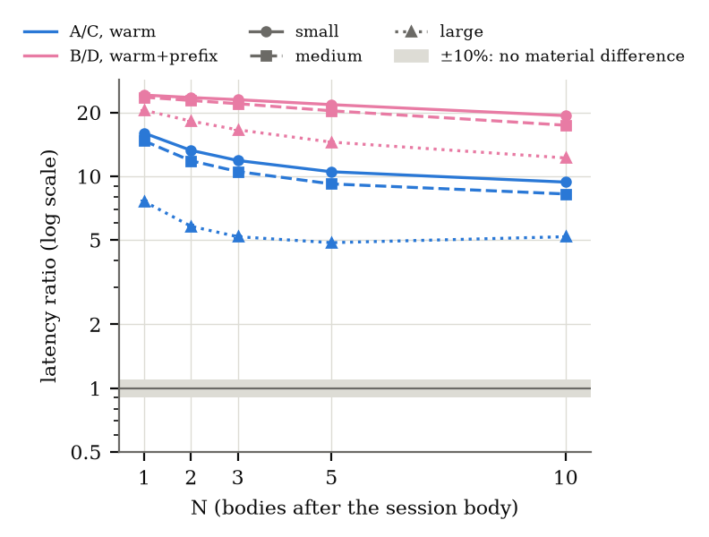

# Benchmarks

`BENCHMARKS.md` is generated by `dc-bench benchmarks` from `crates/dc-bench/BENCHMARKS.template.md`. Every number in it comes from the 51 verified archives of M9's raw data, through the report generator (`results/archive/MANIFEST.sha256`; frozen plan §5); none is typed by hand. The plan is frozen at `bench-freeze-2` ([BENCH_PLAN_FROZEN.md](BENCH_PLAN_FROZEN.md)). §8's phase breakdown and AIP run, which are exploratory, come from their own verified archives (`results/exploratory/phases/` and `results/exploratory/aip/`, each with `archive/MANIFEST.sha256`).

## Summary for the author

By the frozen rule, BLS aggregation is **not a net benefit**. In the deployment pattern the plan's §1 asks about (arm B against arm D, warm+prefix, N = 3, medium), the latency ratio is 21.995 [21.994, 21.995], and every run agrees (22.003, 21.951, 21.997). It is not a net benefit in any cell, with caching or without. B is 12.2–24.2× slower than D (16 of 16 cells). Warm, A is 4.9–16.0× slower than C and 5.8–19.5× slower than C-batch (16 of 16 and 16 of 16 cells), and cold it is 10.1–20.5× slower than C. No N from 1 to 10 reverses this, although the gap narrows as N grows. With the pairing and prefix caches, B's hit still costs one pairing check, 578–589 µs whatever N is (medium), where D's hit costs one Ed25519 verification, 24.5–33.8 µs.

Aggregation saves bytes against Ed25519 only from N = 2 in the small profile, N = 2 in medium and N = 2 in large, and from N = 3 when the chain carries an approval receipt. At N = 1, A's chain is larger (+13 bytes, medium), because every body carries 48-byte BLS keys where Ed25519's are 32. The saving stays small. At N = 3 (medium), A's chain is 1826 bytes against C's 1881, 2.9% smaller, and 5.3% smaller at N = 10, because A's 96-byte aggregate is only 5.3% of the chain. Against individual BLS signatures, aggregation saves 98.0 bytes per hop, 13.9% of A-ind's chain at N = 3.

Of the paper claims checked against revision 2026-09-29, one is **not supported**: that cheap checks reject hostile chains before any pairing. It holds only on a warm verifier, because a cold one first pays its N + 1 certificate pairings (P-28). The others are supported: aggregation's saving over individual BLS (A/A-ind 0.387–0.594 warm, N ≥ 2); the α + βN model (R² 0.9999, β ≈ 0.87 of one hash to G2 plus one Miller loop, and the per-hop term dominating beyond N ≈ 2.9); the constant 96-byte signature; inline certificates costing more per hop than aggregation saves (249 against 98.0 bytes); a registry-free steady state; and the need for a non-aggregating baseline, which, measured, decides against aggregation. Arm E (Biscuit) ran faster than AIP's published figures, beyond the sanity rule's 3× in the small profile at N = 1, 2, 3, 5 and the medium profile at N = 1. The harness measures what D-68 specifies, but AIP's published "verify" is a larger operation: it decodes base64, verifies every block's signature twice, and parses its authorizer from Datalog text. That explains the direction of the gap and part of its size; the rest is unexplained (Q9).

## 1. Environment

| | |
|---|---|
| Machine | Apple M4 Max, 10 performance + 4 efficiency cores, 38654705664 bytes of memory |
| OS | macOS 26.5.2 (25F84) |
| Power | AC Power, `powermode` 2 (High Power); confirmed at the first start and at the resume (true, true) |
| Toolchain | rustc 1.97.1 (8bab26f4f 2026-07-14); release profile, fat LTO, `RUSTFLAGS="-C target-cpu=native"` |
| Crates | blst 0.3.17, armv8 assembly (no ADX path on aarch64); ed25519-dalek 2.2.0 with curve25519-dalek 4.1.3, serial u64 (the SIMD backends are x86_64-only); sha2 0.9.9, 0.10.9; biscuit-auth 6.0.0; criterion 0.5.1 |
| Scheduling | none: macOS has no working thread-affinity API on Apple Silicon; measuring threads use QoS user-interactive (D-42) |
| Timer | std::time::Instant (mach_absolute_time on macOS) |
| Code | first start at `4e134dccf5aa26ba39ee0fac5d4f366eec8567ab` (`bench-freeze-2`): runs 1 and 2's main processes and run 1's A-mt process. Resume at `b175599188a382a0a5e777c3f57d3876bf5bc2df`: run 2's A-mt redo, run 3, every re-run, memory and criterion. "Dirty" in `env.json` means only untracked files (the console log and the outputs being written); the measured code path is identical at both commits (BENCH_LOG.md, 2026-10-01). |
| Dates (UTC) | 2026-09-30T20:12:45Z (start), 2026-10-01T01:27:56Z (resume) |

## 2. Method

The method is the frozen plan's ([BENCH_PLAN_FROZEN.md](BENCH_PLAN_FROZEN.md), `bench-freeze-2`), with the post-measurement deviations in §7.
- **Grid.** 231 latency configurations, over 3 runs in separate processes, each in a seeded random order.
- **Counts.** 1,000 warm-up and 10,000 measured verifications per configuration, except Q5's injected-latency configurations (D-44).
- **Timing.** Every timed operation is one `verify` call on pre-generated bytes. Every measured verification was accepted, and every measured prefix-cache call hit or missed as its state requires.
- **Statistics.** Medians with bootstrap 95% CIs, pooled over runs. Each ratio gets a ±10% practical-significance margin, and its verdict stands only if all three runs agree (frozen plan §6).
- **Plots:** `results/plots/`.

**How the plan's open points were read:**
- **Break-even.** The first N in 1–10 at which A's and C's byte counts swap order.
- **Bytes.** Exact means over 20 chains (they vary only with identifier lengths), compared directly with no margin.
- **Claims.** §7's verdict criteria are stated beside each claim.
- **The two A-mt configurations flagged again** in their re-run use the re-run samples, like every re-run (marked †).
- **Run-to-run variation** is (max − min) of the run medians over the pooled median.

## 3. Results (generated)

### Verdicts

Ratios are the aggregating arm over the non-aggregating one: `median [95% CI]`. With a ±10% margin: **net benefit** if the CI's upper bound < 0.90; **not a net benefit** if the lower bound > 1.10; **no material difference** if the CI lies within [0.90, 1.10]; **inconclusive** otherwise. A verdict stands only if every run's own ratio of medians is on the same side of the margin; otherwise **inconclusive (runs disagree)**.

**§1, the deployment pattern (B/D, warm+prefix, N = 3, medium):** 21.995 [21.994, 21.995] — **not a net benefit** (runs: 22.003, 21.951, 21.997)

**Every call a new chain (N = 3, medium, warm):** A/C 10.522 [10.522, 10.526] — **not a net benefit** (runs: 10.520, 10.538, 10.515); A/C-batch 14.912 [14.911, 14.920] — **not a net benefit** (runs: 14.898, 14.952, 14.883)

| profile | N | B/D warm+prefix | A/C warm | A/C-batch warm | B/D prefix-miss |
|---|---|---|---|---|---|
| small | 1 | 24.151 [24.149, 24.153] — **not a net benefit** (runs: 24.097, 24.112, 24.206) | 15.984 [15.971, 15.985] — **not a net benefit** (runs: 15.995, 15.864, 16.083) | 19.457 [19.455, 19.458] — **not a net benefit** (runs: 19.432, 19.487, 19.474) | 20.291 [20.290, 20.309] — **not a net benefit** (runs: 20.278, 20.298, 20.329) |
| small | 2 | 23.518 [23.479, 23.520] — **not a net benefit** (runs: 23.403, 23.477, 23.559) | 13.249 [13.249, 13.250] — **not a net benefit** (runs: 13.232, 13.240, 13.276) | 18.512 [18.512, 18.513] — **not a net benefit** (runs: 18.510, 18.496, 18.517) | 18.539 [18.539, 18.540] — **not a net benefit** (runs: 18.536, 18.507, 18.573) |
| small | 3 | 22.974 [22.972, 23.011] — **not a net benefit** (runs: 22.967, 22.950, 23.040) | 11.864 [11.864, 11.865] — **not a net benefit** (runs: 11.872, 11.828, 11.905) | 17.973 [17.973, 17.986] — **not a net benefit** (runs: 18.053, 17.941, 17.976) | 17.654 [17.645, 17.654] — **not a net benefit** (runs: 17.645, 17.653, 17.527) |
| small | 5 | 21.767 [21.767, 21.768] — **not a net benefit** (runs: 21.769, 21.775, 21.761) | 10.496 [10.496, 10.496] — **not a net benefit** (runs: 10.503, 10.470, 10.516) | 17.389 [17.388, 17.398] — **not a net benefit** (runs: 17.432, 17.363, 17.345) | 16.749 [16.749, 16.755] — **not a net benefit** (runs: 16.767, 16.723, 16.767) |
| small | 10 | 19.324 [19.324, 19.326] — **not a net benefit** (runs: 19.357, 19.322, 19.323) | 9.380 [9.379, 9.381] — **not a net benefit** (runs: 9.382, 9.276, 9.398) | 16.896 [16.894, 16.901] — **not a net benefit** (runs: 16.872, 16.698, 16.975) | 16.306 [16.305, 16.309] — **not a net benefit** (runs: 16.329, 16.360, 15.979) |
| medium | 1 | 23.607 [23.605, 23.609] — **not a net benefit** (runs: 23.599, 23.536, 23.683) | 14.676 [14.676, 14.678] — **not a net benefit** (runs: 14.623, 14.664, 14.733) | 17.401 [17.400, 17.402] — **not a net benefit** (runs: 17.373, 17.366, 17.464) | 18.321 [18.320, 18.323] — **not a net benefit** (runs: 18.272, 18.349, 18.332) |
| medium | 2 | 22.773 [22.770, 22.774] — **not a net benefit** (runs: 22.737, 22.767, 22.774) | 11.831 [11.830, 11.831] — **not a net benefit** (runs: 11.821, 11.816, 11.861) | 15.812 [15.811, 15.813] — **not a net benefit** (runs: 15.849, 15.784, 15.793) | 16.321 [16.321, 16.322] — **not a net benefit** (runs: 16.299, 16.313, 16.351) |
| medium | 3 | 21.995 [21.994, 21.995] — **not a net benefit** (runs: 22.003, 21.951, 21.997) | 10.522 [10.522, 10.526] — **not a net benefit** (runs: 10.520, 10.538, 10.515) | 14.912 [14.911, 14.920] — **not a net benefit** (runs: 14.898, 14.952, 14.883) | 15.400 [15.394, 15.400] — **not a net benefit** (runs: 15.386, 15.388, 15.431) |
| medium | 5 | 20.365 [20.364, 20.367] — **not a net benefit** (runs: 20.376, 20.329, 20.362) | 9.198 [9.196, 9.198] — **not a net benefit** (runs: 9.199, 9.194, 9.199) | 13.993 [13.992, 13.998] — **not a net benefit** (runs: 13.945, 13.993, 14.029) | 14.477 [14.473, 14.477] — **not a net benefit** (runs: 14.439, 14.475, 14.512) |
| medium | 10 | 17.404 [17.403, 17.405] — **not a net benefit** (runs: 17.429, 17.409, 17.419) | 8.247 [8.245, 8.249] — **not a net benefit** (runs: 8.209, 8.365, 8.229) | 13.273 [13.272, 13.276] — **not a net benefit** (runs: 13.244, 13.269, 13.284) | 13.918 [13.917, 13.920] — **not a net benefit** (runs: 13.922, 13.906, 13.919) |
| large | 1 | 20.473 [20.472, 20.503] — **not a net benefit** (runs: 20.447, 20.476, 20.523) | 7.603 [7.602, 7.605] — **not a net benefit** (runs: 7.450, 7.656, 7.606) | 8.268 [8.265, 8.272] — **not a net benefit** (runs: 8.130, 8.328, 8.277) | 9.112 [9.108, 9.115] — **not a net benefit** (runs: 9.125, 9.139, 9.079) |
| large | 2 | 18.208 [18.207, 18.210] — **not a net benefit** (runs: 18.256, 18.185, 18.209) | 5.805 [5.804, 5.807] — **not a net benefit** (runs: 5.806, 5.782, 5.912) | 6.593 [6.590, 6.596] — **not a net benefit** (runs: 6.525, 6.653, 6.604) | 7.644 [7.642, 7.648] — **not a net benefit** (runs: 7.593, 7.633, 7.706) |
| large | 3 | 16.557 [16.557, 16.558] — **not a net benefit** (runs: 16.571, 16.548, 16.567) | 5.182 [5.180, 5.184] — **not a net benefit** (runs: 5.225, 5.118, 5.245) | 5.950 [5.949, 5.952] — **not a net benefit** (runs: 5.879, 5.964, 6.038) | 7.237 [7.235, 7.240] — **not a net benefit** (runs: 7.123, 7.289, 7.315) |
| large | 5 | 14.489 [14.473, 14.490] — **not a net benefit** (runs: 14.458, 14.428, 14.528) | 4.857 [4.856, 4.858] — **not a net benefit** (runs: 4.859, 4.845, 4.869) | 5.806 [5.804, 5.808] — **not a net benefit** (runs: 5.754, 5.863, 5.810) | 7.242 [7.240, 7.244] — **not a net benefit** (runs: 7.174, 7.216, 7.314) |
| large | 10 | 12.198 [12.197, 12.199] — **not a net benefit** (runs: 12.193, 12.194, 12.217) | 5.182 [5.181, 5.183] — **not a net benefit** (runs: 5.176, 5.205, 5.179) | 6.713 [6.711, 6.716] — **not a net benefit** (runs: 6.633, 6.701, 6.909) | 8.322 [8.321, 8.324] — **not a net benefit** (runs: 8.264, 8.234, 8.408) |
| medium-approval | 3 | 23.011 [23.009, 23.012] — **not a net benefit** (runs: 23.029, 22.996, 23.007) | 12.991 [12.986, 12.991] — **not a net benefit** (runs: 13.001, 13.009, 12.954) | 17.136 [17.135, 17.136] — **not a net benefit** (runs: 17.132, 17.148, 17.126) | 16.982 [16.981, 16.982] — **not a net benefit** (runs: 16.976, 17.025, 16.942) |

### Q1. Warm per-invocation latency (µs)

#### small

| N | A warm | A-ind warm | C warm | C-batch warm | B warm+prefix | D warm+prefix | B prefix-miss | D prefix-miss | A-mt warm (supplementary: multi-threaded blst) |
|---|---|---|---|---|---|---|---|---|---|
| 1 | 761 [761, 761] / 809 | 1154 [1154, 1154] / 1200 | 47.6 [47.6, 47.7] / 63.1 | 39.1 [39.1, 39.1] / 41.8 | 578 [578, 578] / 608 | 23.9 [23.9, 23.9] / 26.2 | 988 [988, 988] / 1028 | 48.7 [48.7, 48.7] / 53.2 | 476 [475, 476] / 499 † |
| 2 | 946 [946, 946] / 983 | 1732 [1732, 1732] / 1794 | 71.4 [71.4, 71.4] / 76.4 | 51.1 [51.1, 51.1] / 56.4 | 578 [578, 578] / 604 | 24.6 [24.6, 24.6] / 29.0 | 1355 [1355, 1355] / 1408 | 73.1 [73.1, 73.1] / 78.2 | 493 [493, 493] / 519 † |
| 3 | 1130 [1130, 1130] / 1183 | 2309 [2309, 2309] / 2396 | 95.2 [95.2, 95.2] / 101 | 62.9 [62.8, 62.9] / 69.0 | 579 [579, 579] / 605 | 25.2 [25.2, 25.2] / 27.7 | 1720 [1720, 1721] / 1778 † | 97.5 [97.5, 97.5] / 105 | 514 [514, 514] / 539 |
| 5 | 1498 [1498, 1498] / 1552 | 3463 [3463, 3463] / 3582 | 143 [143, 143] / 149 | 86.2 [86.1, 86.2] / 91.1 † | 580 [580, 580] / 609 | 26.7 [26.7, 26.7] / 29.2 | 2453 [2453, 2453] / 2538 | 146 [146, 146] / 159 | 555 [554, 555] / 730 |
| 10 | 2458 [2457, 2458] / 2538 | 6347 [6347, 6347] / 6572 | 262 [262, 262] / 274 | 145 [145, 145] / 152 | 584 [584, 584] / 610 | 30.2 [30.2, 30.2] / 34.8 | 4367 [4367, 4367] / 4508 | 268 [268, 268] / 284 | 757 [757, 757] / 778 † |

#### medium

| N | A warm | A-ind warm | C warm | C-batch warm | B warm+prefix | D warm+prefix | B prefix-miss | D prefix-miss | A-mt warm (supplementary: multi-threaded blst) |
|---|---|---|---|---|---|---|---|---|---|
| 1 | 766 [766, 766] / 795 | 1159 [1159, 1159] / 1203 | 52.2 [52.2, 52.2] / 57.1 | 44.0 [44.0, 44.0] / 54.1 | 578 [578, 578] / 605 | 24.5 [24.5, 24.5] / 28.0 | 994 [994, 994] / 1035 | 54.2 [54.2, 54.2] / 59.5 | 483 [483, 483] / 502 † |
| 2 | 955 [955, 955] / 995 | 1741 [1741, 1741] / 1802 | 80.8 [80.8, 80.8] / 87.0 | 60.4 [60.4, 60.4] / 66.2 | 580 [580, 580] / 607 | 25.5 [25.5, 25.5] / 28.0 | 1366 [1366, 1366] / 1414 | 83.7 [83.7, 83.7] / 90.1 | 490 [490, 490] / 520 † |
| 3 | 1144 [1144, 1144] / 1188 | 2322 [2322, 2322] / 2410 | 109 [109, 109] / 116 | 76.7 [76.7, 76.7] / 82.4 | 580 [580, 580] / 605 | 26.4 [26.4, 26.4] / 28.7 | 1737 [1737, 1737] / 1795 | 113 [113, 113] / 119 | 533 [533, 533] / 558 |
| 5 | 1522 [1522, 1522] / 1577 | 3486 [3486, 3486] / 3610 | 166 [166, 166] / 172 | 109 [109, 109] / 115 | 583 [583, 583] / 607 | 28.6 [28.6, 28.6] / 30.8 | 2480 [2480, 2480] / 2562 | 171 [171, 171] / 182 | 557 [557, 558] / 734 † |
| 10 | 2506 [2506, 2506] / 2588 | 6394 [6394, 6394] / 6621 | 304 [304, 304] / 319 | 189 [189, 189] / 199 | 589 [589, 589] / 616 | 33.8 [33.8, 33.8] / 36.4 | 4421 [4421, 4421] / 4578 | 318 [318, 318] / 335 | 786 [786, 786] / 825 |

#### large

| N | A warm | A-ind warm | C warm | C-batch warm | B warm+prefix | D warm+prefix | B prefix-miss | D prefix-miss | A-mt warm (supplementary: multi-threaded blst) |
|---|---|---|---|---|---|---|---|---|---|
| 1 | 819 [819, 819] / 855 | 1214 [1214, 1214] / 1265 | 108 [108, 108] / 117 | 99.1 [99.0, 99.1] / 107 | 583 [583, 583] / 610 | 28.5 [28.4, 28.5] / 30.8 | 1058 [1058, 1058] / 1101 | 116 [116, 116] / 125 | 535 [534, 535] / 559 † |
| 2 | 1056 [1056, 1056] / 1100 | 1842 [1842, 1842] / 1904 | 182 [182, 182] / 192 | 160 [160, 160] / 171 | 586 [586, 586] / 615 | 32.2 [32.2, 32.2] / 35.3 | 1475 [1475, 1475] / 1523 | 193 [193, 193] / 206 | 598 [597, 598] / 629 † |
| 3 | 1280 [1280, 1280] / 1321 | 2460 [2460, 2460] / 2556 | 247 [247, 247] / 266 | 215 [215, 215] / 225 | 590 [590, 590] / 618 | 35.6 [35.6, 35.6] / 40.3 | 1884 [1884, 1884] / 1950 | 260 [260, 260] / 276 | 660 [659, 660] / 697 † |
| 5 | 1703 [1703, 1703] / 1766 | 3676 [3676, 3676] / 3860 | 351 [351, 351] / 365 | 293 [293, 293] / 318 | 595 [595, 595] / 620 | 41.1 [41.1, 41.1] / 45.8 | 2676 [2676, 2676] / 2768 | 370 [369, 370] / 396 | 762 [761, 762] / 940 |
| 10 | 2727 [2727, 2727] / 2823 | 6618 [6618, 6618] / 6858 | 526 [526, 526] / 549 | 406 [406, 406] / 428 | 604 [604, 604] / 631 | 49.5 [49.5, 49.5] / 53.7 | 4653 [4653, 4654] / 4817 | 559 [559, 559] / 588 | 1005 [1005, 1005] / 1150 † |

#### medium-approval

| N | A warm | A-ind warm | C warm | C-batch warm | B warm+prefix | D warm+prefix | B prefix-miss | D prefix-miss | A-mt warm (supplementary: multi-threaded blst) |
|---|---|---|---|---|---|---|---|---|---|
| 3 | 1721 [1721, 1721] / 1785 | 2899 [2899, 2899] / 3008 | 132 [132, 132] / 140 | 100 [100, 100] / 108 | 1158 [1158, 1158] / 1201 | 50.3 [50.3, 50.3] / 54.3 | 2314 [2314, 2315] / 2402 | 136 [136, 136] / 149 | 1001 [1000, 1001] / 1063 † |

### Cold state (µs)

#### small

| N | A cold | A-ind cold | C cold | C-batch cold |
|---|---|---|---|---|
| 1 | 1975 [1975, 1975] / 2044 | 2368 [2368, 2368] / 2459 | 96.5 [96.5, 96.5] / 103 | 88.1 [88.1, 88.1] / 93.8 |
| 2 | 2766 [2766, 2766] / 2868 | 3553 [3553, 3553] / 3675 | 144 [144, 144] / 152 | 124 [124, 124] / 132 |
| 3 | 3556 [3556, 3556] / 3676 | 4735 [4735, 4735] / 4897 | 192 [192, 192] / 200 | 160 [160, 160] / 170 |
| 5 | 5137 [5136, 5137] / 5315 | 7105 [7105, 7105] / 7360 | 287 [287, 287] / 302 | 231 [231, 231] / 243 |
| 10 | 9135 [9135, 9135] / 9439 | 13023 [13023, 13023] / 13404 | 526 [526, 526] / 548 | 410 [410, 410] / 432 |

#### medium

| N | A cold | A-ind cold | C cold | C-batch cold |
|---|---|---|---|---|
| 1 | 1982 [1982, 1982] / 2051 | 2376 [2375, 2376] / 2468 | 104 [104, 104] / 110 | 95.6 [95.6, 95.6] / 101 |
| 2 | 2779 [2779, 2779] / 2879 | 3564 [3564, 3564] / 3690 | 156 [156, 156] / 166 | 136 [136, 136] / 146 |
| 3 | 3573 [3573, 3573] / 3702 | 4753 [4753, 4753] / 4922 | 208 [208, 208] / 222 | 176 [176, 176] / 186 |
| 5 | 5165 [5165, 5165] / 5351 | 7132 [7132, 7132] / 7384 | 313 [313, 313] / 332 | 256 [256, 257] / 268 |
| 10 | 9183 [9183, 9183] / 9471 | 13071 [13071, 13071] / 13476 | 573 [573, 573] / 607 | 456 [455, 456] / 478 |

#### large

| N | A cold | A-ind cold | C cold | C-batch cold |
|---|---|---|---|---|
| 1 | 2061 [2061, 2061] / 2132 | 2454 [2454, 2454] / 2541 | 182 [182, 182] / 195 | 174 [174, 174] / 183 |
| 2 | 2904 [2904, 2904] / 3053 | 3689 [3689, 3689] / 3822 | 279 [279, 279] / 304 | 258 [258, 258] / 274 |
| 3 | 3739 [3738, 3739] / 3878 | 4917 [4917, 4917] / 5094 | 369 [369, 369] / 392 | 328 [328, 328] / 350 |
| 5 | 5380 [5380, 5380] / 5571 | 7346 [7346, 7346] / 7608 | 519 [519, 519] / 541 | 467 [467, 467] / 487 |
| 10 | 9434 [9433, 9434] / 9742 | 13320 [13320, 13321] / 13740 | 818 [817, 818] / 849 | 698 [698, 698] / 731 |

#### medium-approval

| N | A cold | A-ind cold | C cold | C-batch cold |
|---|---|---|---|---|
| 3 | 4757 [4757, 4757] / 4929 | 5937 [5937, 5937] / 6149 | 256 [256, 256] / 271 | 224 [224, 224] / 240 |

### Q2. Bytes on the wire

Bytes are exact means over 20 sampled chains per cell (they vary only with identifier lengths).

#### Primary: A against C

**small** — break-even: N = 2: A is smaller than C from N = 2 on (A > C at N = 1)

| N | A total | C total | A − C | A / C | A signatures | C signatures |
|---|---|---|---|---|---|---|
| 1 | 610 | 597 | +13 | 1.022 | 96 | 128 |
| 2 | 870 | 890 | -20 | 0.978 | 96 | 192 |
| 3 | 1131 | 1184 | -53 | 0.955 | 96 | 256 |
| 4 | 1391 | 1477 | -86 | 0.942 | 96 | 320 |
| 5 | 1651 | 1770 | -119 | 0.933 | 96 | 384 |
| 6 | 1912 | 2064 | -152 | 0.926 | 96 | 448 |
| 7 | 2172 | 2357 | -185 | 0.922 | 96 | 512 |
| 8 | 2432 | 2650 | -218 | 0.918 | 96 | 576 |
| 9 | 2693 | 2944 | -251 | 0.915 | 96 | 640 |
| 10 | 2953 | 3237 | -284 | 0.912 | 96 | 704 |

**medium** — break-even: N = 2: A is smaller than C from N = 2 on (A > C at N = 1)

| N | A total | C total | A − C | A / C | A signatures | C signatures |
|---|---|---|---|---|---|---|
| 1 | 847 | 834 | +13 | 1.016 | 96 | 128 |
| 2 | 1336 | 1357 | -21 | 0.985 | 96 | 192 |
| 3 | 1826 | 1881 | -55 | 0.971 | 96 | 256 |
| 4 | 2315 | 2404 | -89 | 0.963 | 96 | 320 |
| 5 | 2804 | 2927 | -123 | 0.958 | 96 | 384 |
| 6 | 3294 | 3451 | -157 | 0.955 | 96 | 448 |
| 7 | 3783 | 3974 | -191 | 0.952 | 96 | 512 |
| 8 | 4272 | 4498 | -225 | 0.950 | 96 | 576 |
| 9 | 4762 | 5021 | -259 | 0.948 | 96 | 640 |
| 10 | 5251 | 5544 | -293 | 0.947 | 96 | 704 |

**medium-approval** — break-even: N = 3: A is smaller than C from N = 3 on (A > C at N = 1)

| N | A total | C total | A − C | A / C | A signatures | C signatures |
|---|---|---|---|---|---|---|
| 1 | 1100 | 1039 | +61 | 1.059 | 96 | 128 |
| 2 | 1589 | 1562 | +27 | 1.017 | 96 | 192 |
| 3 | 2079 | 2086 | -7 | 0.997 | 96 | 256 |
| 4 | 2568 | 2609 | -41 | 0.984 | 96 | 320 |
| 5 | 3057 | 3132 | -75 | 0.976 | 96 | 384 |
| 6 | 3547 | 3656 | -109 | 0.970 | 96 | 448 |
| 7 | 4036 | 4179 | -143 | 0.966 | 96 | 512 |
| 8 | 4526 | 4702 | -177 | 0.962 | 96 | 576 |
| 9 | 5015 | 5226 | -211 | 0.960 | 96 | 640 |
| 10 | 5504 | 5749 | -245 | 0.957 | 96 | 704 |

**large** — break-even: N = 2: A is smaller than C from N = 2 on (A > C at N = 1)

| N | A total | C total | A − C | A / C | A signatures | C signatures |
|---|---|---|---|---|---|---|
| 1 | 2701 | 2688 | +13 | 1.005 | 96 | 128 |
| 2 | 4767 | 4788 | -21 | 0.996 | 96 | 192 |
| 3 | 6562 | 6617 | -55 | 0.992 | 96 | 256 |
| 4 | 8117 | 8206 | -89 | 0.989 | 96 | 320 |
| 5 | 9396 | 9519 | -123 | 0.987 | 96 | 384 |
| 6 | 10420 | 10577 | -157 | 0.985 | 96 | 448 |
| 7 | 11187 | 11378 | -191 | 0.983 | 96 | 512 |
| 8 | 11954 | 12180 | -225 | 0.982 | 96 | 576 |
| 9 | 12722 | 12981 | -259 | 0.980 | 96 | 640 |
| 10 | 13489 | 13782 | -293 | 0.979 | 96 | 704 |

medium-approval chains also carry the receipt: its approver key and signature are 48 + 96 bytes under BLS and 32 + 64 under Ed25519.

#### Aggregation ablation: A against A-ind

| profile | N | A total | A-ind total | saved by aggregation | A-ind / A |
|---|---|---|---|---|---|
| small | 1 | 610 | 709 | 99 | 1.162 |
| small | 2 | 870 | 1067 | 197 | 1.226 |
| small | 3 | 1131 | 1426 | 295 | 1.261 |
| small | 5 | 1651 | 2142 | 491 | 1.297 |
| small | 10 | 2953 | 3934 | 981 | 1.332 |
| medium | 1 | 847 | 946 | 99 | 1.117 |
| medium | 2 | 1336 | 1533 | 197 | 1.147 |
| medium | 3 | 1826 | 2121 | 295 | 1.162 |
| medium | 5 | 2804 | 3295 | 491 | 1.175 |
| medium | 10 | 5251 | 6232 | 981 | 1.187 |
| medium-approval | 1 | 1100 | 1199 | 99 | 1.090 |
| medium-approval | 2 | 1589 | 1786 | 197 | 1.124 |
| medium-approval | 3 | 2079 | 2374 | 295 | 1.142 |
| medium-approval | 5 | 3057 | 3548 | 491 | 1.161 |
| medium-approval | 10 | 5504 | 6485 | 981 | 1.178 |
| large | 1 | 2701 | 2800 | 99 | 1.037 |
| large | 2 | 4767 | 4964 | 197 | 1.041 |
| large | 3 | 6562 | 6857 | 295 | 1.045 |
| large | 5 | 9396 | 9887 | 491 | 1.052 |
| large | 10 | 13489 | 14470 | 981 | 1.073 |

#### Arm E (Biscuit tokens)

| profile | N (depth N−1) | token bytes |
|---|---|---|
| small | 1 | 586 |
| small | 2 | 988 |
| small | 3 | 1390 |
| small | 5 | 2194 |
| small | 10 | 4204 |
| medium | 1 | 1275 |
| medium | 2 | 2195 |
| medium | 3 | 3115 |
| medium | 5 | 4955 |
| medium | 10 | 9555 |
| large | 1 | 7219 |
| large | 2 | 12894 |
| large | 3 | 17778 |
| large | 5 | 25124 |
| large | 10 | 34683 |

Certificate size in this encoding: BLS 249 bytes, Ed25519 185 bytes. Paper §8.2 assumes 48 + 96 bytes per BLS certificate before any other field; `bytes.json` also gives every chain's size with N + 1 certificates inline.

### Q3. Cost model for arm A

| state | profile | α (µs) [CI] | β (µs) [CI] | R² | 10β/α [CI] | residuals (µs, N = 1, 2, 3, 5, 10) |
|---|---|---|---|---|---|---|
| warm | small | 567 [566, 567] | 189 [189, 189] | 0.9999 | 3.329 [3.328, 3.330] | 6.2, 2.0, -2.2, -11.1, 5.2 |
| warm | medium | 566 [566, 566] | 193 [193, 193] | 0.9999 | 3.417 [3.417, 3.418] | 6.1, 2.3, -2.6, -11.0, 5.2 |
| warm | large | 632 [632, 633] | 211 [211, 211] | 0.9994 | 3.330 [3.329, 3.330] | -23.8, 1.9, 16.0, 17.4, -11.5 |
| cold | small | 1172 [1172, 1172] | 796 [796, 796] | 1.0000 | 6.790 [6.790, 6.791] | 7.5, 2.6, -2.8, -13.7, 6.4 |
| cold | medium | 1176 [1176, 1176] | 800 [800, 800] | 1.0000 | 6.806 [6.806, 6.807] | 6.2, 2.6, -2.9, -11.3, 5.4 |
| cold | large | 1269 [1268, 1269] | 818 [818, 818] | 1.0000 | 6.447 [6.446, 6.448] | -25.3, 0.1, 16.4, 22.4, -13.6 |

The per-hop term dominates by N = 10 if 10β/α's CI lies above 1, the fixed term if it lies below, neither otherwise; the crossover is N = α/β.

### Q4. A / A-ind

| profile | N | warm | cold |
|---|---|---|---|
| small | 1 | 0.659 [0.659, 0.659] — **net benefit** (runs: 0.660, 0.659, 0.660) | 0.834 [0.834, 0.834] — **net benefit** (runs: 0.834, 0.834, 0.834) |
| small | 2 | 0.546 [0.546, 0.546] — **net benefit** (runs: 0.546, 0.546, 0.546) | 0.778 [0.778, 0.778] — **net benefit** (runs: 0.779, 0.778, 0.779) |
| small | 3 | 0.489 [0.489, 0.489] — **net benefit** (runs: 0.490, 0.489, 0.490) | 0.751 [0.751, 0.751] — **net benefit** (runs: 0.751, 0.751, 0.752) |
| small | 5 | 0.433 [0.433, 0.433] — **net benefit** (runs: 0.433, 0.432, 0.433) | 0.723 [0.723, 0.723] — **net benefit** (runs: 0.723, 0.720, 0.723) |
| small | 10 | 0.387 [0.387, 0.387] — **net benefit** (runs: 0.387, 0.383, 0.388) | 0.701 [0.701, 0.701] — **net benefit** (runs: 0.701, 0.701, 0.702) |
| medium | 1 | 0.661 [0.661, 0.661] — **net benefit** (runs: 0.661, 0.660, 0.661) | 0.834 [0.834, 0.834] — **net benefit** (runs: 0.834, 0.834, 0.834) |
| medium | 2 | 0.549 [0.549, 0.549] — **net benefit** (runs: 0.549, 0.549, 0.548) | 0.780 [0.780, 0.780] — **net benefit** (runs: 0.780, 0.780, 0.780) |
| medium | 3 | 0.493 [0.493, 0.493] — **net benefit** (runs: 0.493, 0.493, 0.492) | 0.752 [0.752, 0.752] — **net benefit** (runs: 0.752, 0.752, 0.752) |
| medium | 5 | 0.437 [0.437, 0.437] — **net benefit** (runs: 0.437, 0.437, 0.437) | 0.724 [0.724, 0.724] — **net benefit** (runs: 0.724, 0.724, 0.725) |
| medium | 10 | 0.392 [0.392, 0.392] — **net benefit** (runs: 0.392, 0.391, 0.392) | 0.703 [0.703, 0.703] — **net benefit** (runs: 0.702, 0.703, 0.703) |
| large | 1 | 0.675 [0.675, 0.675] — **net benefit** (runs: 0.664, 0.676, 0.675) | 0.840 [0.840, 0.840] — **net benefit** (runs: 0.839, 0.840, 0.840) |
| large | 2 | 0.573 [0.573, 0.573] — **net benefit** (runs: 0.573, 0.573, 0.573) | 0.787 [0.787, 0.787] — **net benefit** (runs: 0.787, 0.788, 0.787) |
| large | 3 | 0.520 [0.520, 0.520] — **net benefit** (runs: 0.521, 0.520, 0.521) | 0.760 [0.760, 0.760] — **net benefit** (runs: 0.760, 0.760, 0.760) |
| large | 5 | 0.463 [0.463, 0.463] — **net benefit** (runs: 0.464, 0.463, 0.463) | 0.732 [0.732, 0.732] — **net benefit** (runs: 0.732, 0.732, 0.733) |
| large | 10 | 0.412 [0.412, 0.412] — **net benefit** (runs: 0.412, 0.412, 0.412) | 0.708 [0.708, 0.708] — **net benefit** (runs: 0.708, 0.708, 0.708) |

### Q5. Cold path with injected latency

| arm | injected per call | latency | resolver calls / verify | policy-store calls / verify |
|---|---|---|---|---|
| A | 0 ms | 3574 [3574, 3574] / 3697 | 4.00 | 1.00 |
| A | 1 ms | 17470 [17336, 17668] / 20530 † | 4.00 | 1.00 |
| A | 20 ms | 167271 [166463, 167958] / 180805 † | 4.00 | 1.00 |
| A | 80 ms | 469530 [468678, 470339] / 480936 † | 4.00 | 1.00 |
| C | 0 ms | 208 [208, 208] / 220 | 4.00 | 1.00 |
| C | 1 ms | 9456 [9455, 9457] / 9672 † | 4.00 | 1.00 |
| C | 20 ms | 146015 [145419, 146655] / 152230 † | 4.00 | 1.00 |
| C | 80 ms | 445618 [444817, 446206] / 452292 † | 4.00 | 1.00 |

### Q6. Throughput

| arm | threads | accepted/s (median over runs) | per run | p99 per call under load (µs), per run |
|---|---|---|---|---|
| A | 1 | 872 | 872, 871, 872 | 1194, 1193, 1193 |
| A | 2 | 1723 | 1723, 1722, 1723 | 1186, 1186, 1187 |
| A | 4 | 3394 | 3402, 3377, 3394 | 1198, 1241, 1218 |
| A | 8 | 6678 | 6477, 6709, 6678 | 1308, 1224, 1246 |
| A | 10 | 7997 | 7927, 7997, 8331 | 1337, 1294, 1229 |
| A | 14 (includes efficiency cores) | 9067 | 9067, 8827, 9090 | 4090, 4092, 4096 |
| B | 1 | 1712 | 1710, 1712, 1712 | 612, 611, 614 |
| B | 2 | 3378 | 3378, 3377, 3378 | 611, 615, 609 |
| B | 4 | 6663 | 6663, 6483, 6674 | 618, 658, 616 |
| B | 8 | 13218 | 13222, 12489, 13218 | 615, 684, 616 |
| B | 10 | 15924 | 16440, 15022, 15924 | 616, 692, 655 |
| B | 14 (includes efficiency cores) | 18207 | 18207, 18380, 17561 | 2107, 2089, 2107 |
| C | 1 | 9270 | 9194, 9270, 9290 | 117, 115, 115 |
| C | 2 | 18081 | 18072, 18081, 18174 | 118, 117, 116 |
| C | 4 | 35530 | 35452, 35530, 35706 | 120, 119, 119 |
| C | 8 | 68612 | 68866, 67783, 68612 | 126, 128, 127 |
| C | 10 | 84520 | 83155, 84520, 85330 | 132, 128, 128 |
| C | 14 (includes efficiency cores) | 94955 | 94955, 94172, 95895 | 382, 383, 384 |
| D | 1 | 37242 | 37224, 37242, 37305 | 30.7, 30.8, 29.3 |
| D | 2 | 72831 | 72831, 72554, 72961 | 28.7, 29.6, 28.5 |
| D | 4 | 142754 | 142754, 139456, 143333 | 30.8, 30.7, 31.0 |
| D | 8 | 274361 | 274901, 274120, 274361 | 32.3, 32.4, 32.5 |
| D | 10 | 341883 | 341987, 340155, 341883 | 33.0, 33.2, 33.0 |
| D | 14 (includes efficiency cores) | 380684 | 380684, 377466, 382898 | 97.9, 98.4, 98.6 |

### Q9. Arm E against AIP

AIP's figures are **published numbers from different hardware**: an Apple M3 Max under macOS 15.3, against this machine's M4 Max (SPEC §13.10). They match arXiv:2603.24775v1, Table 5, and they time a different operation from arm E's (BENCHMARKS.md, Q9). Arm E lacks registry resolution, PoP, revocation, receipts, the nonce cache and parameter binding (paper Table 1). **Sanity rule (frozen plan §8):** a ratio outside about 3× at matching depth is investigated before anything about arm E is reported.

| profile | N (depth N−1) | E here, µs: median [95% CI] / p99 | AIP published, ms | E / AIP |
|---|---|---|---|---|
| small | 1 | 48.9 [48.9, 48.9] / 54.5 | 0.188 | 0.26 (**outside 3×: investigated, see text**) |
| small | 2 | 82.0 [81.9, 82.0] / 88.0 | 0.292 | 0.28 (**outside 3×: investigated, see text**) |
| small | 3 | 115 [115, 115] / 122 | 0.403 | 0.28 (**outside 3×: investigated, see text**) |
| small | 5 | 180 [180, 180] / 192 | 0.625 | 0.29 (**outside 3×: investigated, see text**) |
| small | 10 | 346 [346, 346] / 362 | — | — |
| medium | 1 | 60.8 [60.8, 60.9] / 67.3 | 0.188 | 0.32 (**outside 3×: investigated, see text**) |
| medium | 2 | 104 [104, 104] / 112 | 0.292 | 0.36 |
| medium | 3 | 147 [147, 147] / 156 | 0.403 | 0.37 |
| medium | 5 | 232 [232, 232] / 246 | 0.625 | 0.37 |
| medium | 10 | 444 [444, 444] / 462 | — | — |
| large | 1 | 208 [208, 208] / 226 | 0.188 | 1.11 |
| large | 2 | 368 [368, 368] / 389 | 0.292 | 1.26 |
| large | 3 | 510 [510, 510] / 541 | 0.403 | 1.26 |
| large | 5 | 733 [733, 733] / 788 | 0.625 | 1.17 |
| large | 10 | 1092 [1092, 1092] / 1161 | — | — |

### Q10. Memory per entry

| structure | entries | bytes retained | bytes per entry |
|---|---|---|---|
| nonce cache (48-byte BLS invoker keys) | 100000 | 10734080 | 107.3 |
| nonce cache (32-byte Ed25519 invoker keys) | 100000 | 9134080 | 91.3 |
| certificate cache, BLS (arms A, A-ind, B) | 100001 | 65400904 | 654.0 |
| certificate cache, Ed25519 (arms C, C-batch, D) | 100001 | 70200952 | 702.0 |
| prefix cache, arm B (N = 3, medium) | 100000 | 399623958 | 3996.2 |
| prefix cache, arm D (N = 3, medium) | 100000 | 363623958 | 3636.2 |

### Q7, Q8 and primitives (criterion)

| benchmark | median (µs) [95% CI] |
|---|---|
| bls/aggregate_verify/10 | 2219 [2219, 2220] |
| bls/aggregate_verify/11 | 2405 [2404, 2405] |
| bls/aggregate_verify/2 | 713 [712, 713] |
| bls/aggregate_verify/3 | 894 [893, 894] |
| bls/aggregate_verify/4 | 1075 [1074, 1075] |
| bls/aggregate_verify/5 | 1257 [1256, 1257] |
| bls/aggregate_verify/6 | 1438 [1436, 1438] |
| bls/aggregate_verify/7 | 1617 [1616, 1619] |
| bls/aggregate_verify/8 | 1799 [1796, 1801] |
| bls/aggregate_verify/9 | 2034 [2032, 2034] |
| bls/final_exp | 178 [178, 178] |
| bls/hash_to_g2_proxy | 96.1 [96.1, 96.2] |
| bls/miller_loop | 127 [127, 127] |
| bls/pairing_context | 0.0 [0.0, 0.0] |
| bls/sign | 190 [190, 190] |
| bls/verify | 531 [531, 532] |
| cbor/decode/delegation | 2.3 [2.3, 2.3] |
| cbor/decode/invocation | 0.6 [0.6, 0.6] |
| cbor/decode/session | 2.3 [2.3, 2.3] |
| cbor/encode/delegation | 1.5 [1.5, 1.5] |
| cbor/encode/invocation | 0.5 [0.5, 0.5] |
| cbor/encode/session | 1.6 [1.6, 1.6] |
| ed25519/sign | 8.1 [8.1, 8.1] |
| ed25519/verify_batch/10 | 98.0 [97.9, 98.1] |
| ed25519/verify_batch/11 | 106 [106, 107] |
| ed25519/verify_batch/2 | 32.0 [31.9, 32.0] |
| ed25519/verify_batch/3 | 39.7 [39.7, 39.7] |
| ed25519/verify_batch/4 | 48.2 [48.2, 48.2] |
| ed25519/verify_batch/5 | 56.6 [56.5, 56.6] |
| ed25519/verify_batch/6 | 64.4 [64.3, 64.4] |
| ed25519/verify_batch/7 | 72.8 [72.7, 72.8] |
| ed25519/verify_batch/8 | 81.7 [81.6, 81.8] |
| ed25519/verify_batch/9 | 89.5 [89.3, 89.5] |
| ed25519/verify_strict | 20.6 [20.6, 20.6] |
| policy/contains/typical/r16_a1 | 49.0 [48.6, 49.6] |
| policy/contains/typical/r16_a4 | 141 [141, 141] |
| policy/contains/typical/r16_a8 | 325 [324, 327] |
| policy/contains/typical/r1_a1 | 0.2 [0.2, 0.2] |
| policy/contains/typical/r1_a4 | 0.6 [0.6, 0.6] |
| policy/contains/typical/r1_a8 | 1.4 [1.3, 1.4] |
| policy/contains/typical/r4_a1 | 3.3 [3.3, 3.3] |
| policy/contains/typical/r4_a4 | 9.2 [9.2, 9.3] |
| policy/contains/typical/r4_a8 | 20.7 [20.6, 20.9] |
| policy/contains/typical/r64_a1 | 800 [795, 804] |
| policy/contains/typical/r64_a4 | 2247 [2235, 2263] |
| policy/contains/typical/r64_a8 | 5104 [5093, 5119] |
| policy/contains/worst/r16_a1 | 51.1 [50.9, 51.3] |
| policy/contains/worst/r16_a4 | 143 [143, 144] |
| policy/contains/worst/r16_a8 | 324 [323, 328] |
| policy/contains/worst/r1_a1 | 0.2 [0.2, 0.2] |
| policy/contains/worst/r1_a4 | 0.6 [0.6, 0.6] |
| policy/contains/worst/r1_a8 | 1.3 [1.3, 1.4] |
| policy/contains/worst/r4_a1 | 3.2 [3.2, 3.3] |
| policy/contains/worst/r4_a4 | 9.0 [9.0, 9.1] |
| policy/contains/worst/r4_a8 | 21.0 [20.9, 21.0] |
| policy/contains/worst/r64_a1 | 791 [788, 794] |
| policy/contains/worst/r64_a4 | 2256 [2248, 2268] |
| policy/contains/worst/r64_a8 | 5146 [5120, 5166] |
| policy/evaluate/typical/r16_a1 | 0.2 [0.2, 0.2] |
| policy/evaluate/typical/r16_a4 | 0.2 [0.2, 0.2] |
| policy/evaluate/typical/r16_a8 | 0.3 [0.3, 0.3] |
| policy/evaluate/typical/r1_a1 | 0.2 [0.2, 0.2] |
| policy/evaluate/typical/r1_a4 | 0.2 [0.2, 0.2] |
| policy/evaluate/typical/r1_a8 | 0.3 [0.3, 0.3] |
| policy/evaluate/typical/r4_a1 | 0.2 [0.2, 0.2] |
| policy/evaluate/typical/r4_a4 | 0.2 [0.2, 0.2] |
| policy/evaluate/typical/r4_a8 | 0.3 [0.3, 0.3] |
| policy/evaluate/typical/r64_a1 | 0.2 [0.2, 0.2] |
| policy/evaluate/typical/r64_a4 | 0.2 [0.2, 0.2] |
| policy/evaluate/typical/r64_a8 | 0.3 [0.3, 0.3] |
| policy/evaluate/worst/r16_a1 | 0.9 [0.9, 0.9] |
| policy/evaluate/worst/r16_a4 | 1.5 [1.5, 1.5] |
| policy/evaluate/worst/r16_a8 | 2.4 [2.4, 2.4] |
| policy/evaluate/worst/r1_a1 | 0.2 [0.2, 0.2] |
| policy/evaluate/worst/r1_a4 | 0.2 [0.2, 0.2] |
| policy/evaluate/worst/r1_a8 | 0.3 [0.3, 0.3] |
| policy/evaluate/worst/r4_a1 | 0.3 [0.3, 0.3] |
| policy/evaluate/worst/r4_a4 | 0.5 [0.5, 0.5] |
| policy/evaluate/worst/r4_a8 | 0.7 [0.7, 0.7] |
| policy/evaluate/worst/r64_a1 | 3.0 [3.0, 3.0] |
| policy/evaluate/worst/r64_a4 | 5.6 [5.6, 5.6] |
| policy/evaluate/worst/r64_a8 | 9.3 [9.3, 9.3] |
| sha256/chain_digests_medium_n3 | 3.5 [3.5, 3.5] |
| sha256/one_delegation_digest | 1.0 [1.0, 1.0] |
| signing/bls/aggregate_add | 29.3 [29.3, 29.3] |
| signing/bls/hop | 193 [192, 193] |
| signing/bls/issue | 196 [195, 196] |
| signing/bls/receipt | 192 [192, 192] |
| signing/ed25519/aggregate_add | 0.0 [0.0, 0.0] |
| signing/ed25519/hop | 10.5 [10.5, 10.6] |
| signing/ed25519/issue | 12.5 [12.4, 12.5] |
| signing/ed25519/receipt | 10.0 [10.0, 10.0] |

### Throttling and interference

A configuration is flagged if `pmset -g therm` recorded a warning, or if either of its calibration probes ran more than 5% slower than its run's baseline (the median of 5 probes after the settle). Flagged configurations of a main run were re-run after the main runs (`BENCH_LOG.md`), and a run with more than 10% flagged would have been aborted.

| run process | probe baseline (ms) | configurations | flagged: pmset only | probe only | both | total flagged |
|---|---|---|---|---|---|---|
| run1 | 73.6 | 239 | 0 | 6 | 0 | 6 |
| run1-amt | 61.4 | 16 | 0 | 1 | 0 | 1 |
| run1-amt-rerun | 57.6 | 1 | 0 | 0 | 0 | 0 |
| run1-rerun | 71.9 | 6 | 0 | 0 | 0 | 0 |
| run2 | 73.6 | 239 | 0 | 6 | 0 | 6 |
| run2-amt | 58.5 | 16 | 0 | 10 | 0 | 10 |
| run2-amt-rerun | 57.9 | 10 | 0 | 2 | 0 | 2 |
| run2-rerun | 69.6 | 6 | 0 | 0 | 0 | 0 |
| run3 | 73.5 | 239 | 0 | 2 | 0 | 2 |
| run3-amt | 60.3 | 16 | 0 | 1 | 0 | 1 |
| run3-amt-rerun | 58.6 | 1 | 0 | 0 | 0 | 0 |
| run3-rerun | 71.7 | 2 | 0 | 0 | 0 | 0 |

- run1 `A cold+rtt1ms N=3 medium`: probe
- run1 `A cold+rtt20ms N=3 medium`: probe
- run1 `A cold+rtt80ms N=3 medium`: probe
- run1 `C cold+rtt1ms N=3 medium`: probe
- run1 `C cold+rtt20ms N=3 medium`: probe
- run1 `C cold+rtt80ms N=3 medium`: probe
- run1-amt `A-mt warm N=5 medium`: probe
- run2 `A cold+rtt1ms N=3 medium`: probe
- run2 `A cold+rtt20ms N=3 medium`: probe
- run2 `A cold+rtt80ms N=3 medium`: probe
- run2 `C cold+rtt1ms N=3 medium`: probe
- run2 `C cold+rtt20ms N=3 medium`: probe
- run2 `C cold+rtt80ms N=3 medium`: probe
- run2-amt `A-mt warm N=1 large`: probe
- run2-amt `A-mt warm N=1 medium`: probe
- run2-amt `A-mt warm N=1 small`: probe
- run2-amt `A-mt warm N=10 large`: probe
- run2-amt `A-mt warm N=10 small`: probe
- run2-amt `A-mt warm N=2 large`: probe
- run2-amt `A-mt warm N=2 medium`: probe
- run2-amt `A-mt warm N=2 small`: probe
- run2-amt `A-mt warm N=3 large`: probe
- run2-amt `A-mt warm N=3 medium-approval`: probe
- run2-amt-rerun `A-mt warm N=1 large`: probe
- run2-amt-rerun `A-mt warm N=10 small`: probe
- run3 `B prefix-miss N=3 small`: probe
- run3 `C-batch warm N=5 small`: probe
- run3-amt `A-mt warm N=2 medium`: probe

### Run-to-run variation

Per configuration, each run's median (µs) and the spread (max − min) / pooled median.

| configuration | run medians | spread |
|---|---|---|
| A cold N=1 large | 2060, 2062, 2061 | 0.1% |
| A cold N=1 medium | 1982, 1982, 1982 | 0.0% |
| A cold N=1 small | 1975, 1975, 1975 | 0.0% |
| A cold N=2 large | 2902, 2905, 2905 | 0.1% |
| A cold N=2 medium | 2779, 2779, 2778 | 0.0% |
| A cold N=2 small | 2766, 2766, 2766 | 0.0% |
| A cold N=3 large | 3740, 3737, 3739 | 0.1% |
| A cold N=3 medium | 3574, 3573, 3573 | 0.0% |
| A cold N=3 medium-approval | 4757, 4756, 4757 | 0.0% |
| A cold N=3 small | 3557, 3554, 3556 | 0.1% |
| A cold N=5 large | 5377, 5382, 5381 | 0.1% |
| A cold N=5 medium | 5165, 5166, 5165 | 0.0% |
| A cold N=5 small | 5139, 5116, 5138 | 0.4% |
| A cold N=10 large | 9432, 9435, 9433 | 0.0% |
| A cold N=10 medium | 9170, 9184, 9190 | 0.2% |
| A cold N=10 small | 9133, 9136, 9136 | 0.0% |
| A cold+rtt0ms N=3 medium | 3574, 3574, 3574 | 0.0% |
| A cold+rtt1ms N=3 medium | 17424, 17322, 17761 | 2.5% |
| A cold+rtt20ms N=3 medium | 166963, 167032, 167745 | 0.5% |
| A cold+rtt80ms N=3 medium | 469798, 470966, 467233 | 0.8% |
| A warm N=1 large | 806, 821, 820 | 1.9% |
| A warm N=1 medium | 766, 766, 766 | 0.0% |
| A warm N=1 small | 761, 761, 762 | 0.1% |
| A warm N=2 large | 1055, 1056, 1055 | 0.1% |
| A warm N=2 medium | 956, 956, 955 | 0.1% |
| A warm N=2 small | 946, 946, 946 | 0.0% |
| A warm N=3 large | 1281, 1279, 1282 | 0.3% |
| A warm N=3 medium | 1144, 1144, 1144 | 0.0% |
| A warm N=3 medium-approval | 1721, 1720, 1721 | 0.1% |
| A warm N=3 small | 1130, 1130, 1131 | 0.1% |
| A warm N=5 large | 1705, 1699, 1702 | 0.3% |
| A warm N=5 medium | 1522, 1522, 1522 | 0.0% |
| A warm N=5 small | 1498, 1498, 1499 | 0.1% |
| A warm N=10 large | 2726, 2726, 2729 | 0.1% |
| A warm N=10 medium | 2506, 2502, 2508 | 0.3% |
| A warm N=10 small | 2458, 2429, 2464 | 1.4% |
| A-ind cold N=1 large | 2454, 2454, 2454 | 0.0% |
| A-ind cold N=1 medium | 2375, 2376, 2375 | 0.0% |
| A-ind cold N=1 small | 2368, 2368, 2368 | 0.0% |
| A-ind cold N=2 large | 3689, 3688, 3690 | 0.1% |
| A-ind cold N=2 medium | 3563, 3564, 3563 | 0.0% |
| A-ind cold N=2 small | 3552, 3556, 3551 | 0.1% |
| A-ind cold N=3 large | 4918, 4916, 4917 | 0.0% |
| A-ind cold N=3 medium | 4753, 4754, 4752 | 0.0% |
| A-ind cold N=3 medium-approval | 5936, 5938, 5936 | 0.0% |
| A-ind cold N=3 small | 4738, 4735, 4727 | 0.2% |
| A-ind cold N=5 large | 7344, 7348, 7345 | 0.0% |
| A-ind cold N=5 medium | 7138, 7131, 7127 | 0.1% |
| A-ind cold N=5 small | 7105, 7105, 7105 | 0.0% |
| A-ind cold N=10 large | 13323, 13318, 13320 | 0.0% |
| A-ind cold N=10 medium | 13072, 13070, 13071 | 0.0% |
| A-ind cold N=10 small | 13022, 13025, 13022 | 0.0% |
| A-ind warm N=1 large | 1213, 1214, 1215 | 0.2% |
| A-ind warm N=1 medium | 1159, 1159, 1159 | 0.0% |
| A-ind warm N=1 small | 1154, 1155, 1155 | 0.1% |
| A-ind warm N=2 large | 1841, 1842, 1842 | 0.1% |
| A-ind warm N=2 medium | 1740, 1741, 1741 | 0.1% |
| A-ind warm N=2 small | 1731, 1732, 1732 | 0.1% |
| A-ind warm N=3 large | 2459, 2460, 2461 | 0.1% |
| A-ind warm N=3 medium | 2322, 2322, 2323 | 0.0% |
| A-ind warm N=3 medium-approval | 2898, 2900, 2899 | 0.0% |
| A-ind warm N=3 small | 2308, 2310, 2309 | 0.1% |
| A-ind warm N=5 large | 3676, 3674, 3678 | 0.1% |
| A-ind warm N=5 medium | 3485, 3486, 3487 | 0.0% |
| A-ind warm N=5 small | 3461, 3463, 3465 | 0.1% |
| A-ind warm N=10 large | 6618, 6616, 6620 | 0.1% |
| A-ind warm N=10 medium | 6394, 6392, 6396 | 0.1% |
| A-ind warm N=10 small | 6347, 6348, 6343 | 0.1% |
| A-mt warm N=1 large | 539, 521, 538 | 3.3% |
| A-mt warm N=1 medium | 487, 465, 486 | 4.4% |
| A-mt warm N=1 small | 483, 461, 476 | 4.7% |
| A-mt warm N=2 large | 602, 586, 596 | 2.7% |
| A-mt warm N=2 medium | 504, 486, 485 | 4.1% |
| A-mt warm N=2 small | 496, 478, 495 | 3.5% |
| A-mt warm N=3 large | 673, 636, 659 | 5.7% |
| A-mt warm N=3 medium | 534, 532, 534 | 0.5% |
| A-mt warm N=3 medium-approval | 1009, 978, 1004 | 3.1% |
| A-mt warm N=3 small | 520, 500, 517 | 3.8% |
| A-mt warm N=5 large | 768, 721, 770 | 6.5% |
| A-mt warm N=5 medium | 557, 554, 560 | 1.0% |
| A-mt warm N=5 small | 548, 554, 560 | 2.2% |
| A-mt warm N=10 large | 1015, 970, 1010 | 4.5% |
| A-mt warm N=10 medium | 783, 778, 802 | 3.1% |
| A-mt warm N=10 small | 760, 749, 759 | 1.5% |
| B prefix-miss N=1 large | 1059, 1058, 1056 | 0.3% |
| B prefix-miss N=1 medium | 993, 995, 994 | 0.3% |
| B prefix-miss N=1 small | 989, 989, 988 | 0.1% |
| B prefix-miss N=2 large | 1475, 1475, 1474 | 0.1% |
| B prefix-miss N=2 medium | 1366, 1367, 1365 | 0.1% |
| B prefix-miss N=2 small | 1355, 1356, 1354 | 0.1% |
| B prefix-miss N=3 large | 1876, 1887, 1885 | 0.6% |
| B prefix-miss N=3 medium | 1737, 1738, 1736 | 0.1% |
| B prefix-miss N=3 medium-approval | 2315, 2315, 2313 | 0.1% |
| B prefix-miss N=3 small | 1721, 1722, 1706 | 0.9% |
| B prefix-miss N=5 large | 2658, 2682, 2677 | 0.9% |
| B prefix-miss N=5 medium | 2481, 2479, 2480 | 0.1% |
| B prefix-miss N=5 small | 2454, 2453, 2452 | 0.1% |
| B prefix-miss N=10 large | 4663, 4615, 4656 | 1.0% |
| B prefix-miss N=10 medium | 4424, 4419, 4417 | 0.2% |
| B prefix-miss N=10 small | 4371, 4373, 4284 | 2.0% |
| B warm+prefix N=1 large | 583, 583, 582 | 0.1% |
| B warm+prefix N=1 medium | 578, 579, 578 | 0.1% |
| B warm+prefix N=1 small | 577, 578, 578 | 0.1% |
| B warm+prefix N=2 large | 586, 586, 586 | 0.0% |
| B warm+prefix N=2 medium | 580, 580, 580 | 0.0% |
| B warm+prefix N=2 small | 578, 578, 578 | 0.0% |
| B warm+prefix N=3 large | 590, 589, 590 | 0.3% |
| B warm+prefix N=3 medium | 580, 580, 580 | 0.1% |
| B warm+prefix N=3 medium-approval | 1158, 1158, 1158 | 0.0% |
| B warm+prefix N=3 small | 579, 580, 579 | 0.1% |
| B warm+prefix N=5 large | 596, 593, 596 | 0.4% |
| B warm+prefix N=5 medium | 583, 583, 583 | 0.1% |
| B warm+prefix N=5 small | 580, 581, 580 | 0.1% |
| B warm+prefix N=10 large | 604, 604, 604 | 0.1% |
| B warm+prefix N=10 medium | 589, 589, 589 | 0.1% |
| B warm+prefix N=10 small | 584, 584, 584 | 0.0% |
| C cold N=1 large | 183, 183, 180 | 2.0% |
| C cold N=1 medium | 104, 104, 104 | 0.2% |
| C cold N=1 small | 96.5, 96.6, 96.5 | 0.1% |
| C cold N=2 large | 281, 274, 280 | 2.6% |
| C cold N=2 medium | 156, 156, 156 | 0.1% |
| C cold N=2 small | 144, 144, 144 | 0.2% |
| C cold N=3 large | 367, 369, 370 | 0.6% |
| C cold N=3 medium | 208, 208, 208 | 0.2% |
| C cold N=3 medium-approval | 256, 256, 256 | 0.1% |
| C cold N=3 small | 192, 192, 192 | 0.2% |
| C cold N=5 large | 516, 519, 521 | 0.9% |
| C cold N=5 medium | 313, 313, 313 | 0.1% |
| C cold N=5 small | 287, 287, 287 | 0.2% |
| C cold N=10 large | 822, 816, 814 | 1.0% |
| C cold N=10 medium | 573, 573, 574 | 0.2% |
| C cold N=10 small | 525, 526, 526 | 0.1% |
| C cold+rtt0ms N=3 medium | 208, 208, 208 | 0.2% |
| C cold+rtt1ms N=3 medium | 9466, 9463, 9432 | 0.4% |
| C cold+rtt20ms N=3 medium | 146541, 146565, 144914 | 1.1% |
| C cold+rtt80ms N=3 medium | 446449, 444507, 446054 | 0.4% |
| C warm N=1 large | 108, 107, 108 | 0.8% |
| C warm N=1 medium | 52.4, 52.2, 52.0 | 0.8% |
| C warm N=1 small | 47.6, 48.0, 47.4 | 1.2% |
| C warm N=2 large | 182, 183, 178 | 2.3% |
| C warm N=2 medium | 80.8, 80.9, 80.5 | 0.5% |
| C warm N=2 small | 71.5, 71.4, 71.2 | 0.3% |
| C warm N=3 large | 245, 250, 244 | 2.2% |
| C warm N=3 medium | 109, 109, 109 | 0.2% |
| C warm N=3 medium-approval | 132, 132, 133 | 0.5% |
| C warm N=3 small | 95.2, 95.5, 95.0 | 0.5% |
| C warm N=5 large | 351, 351, 350 | 0.4% |
| C warm N=5 medium | 166, 166, 165 | 0.1% |
| C warm N=5 small | 143, 143, 143 | 0.3% |
| C warm N=10 large | 527, 524, 527 | 0.6% |
| C warm N=10 medium | 305, 299, 305 | 2.0% |
| C warm N=10 small | 262, 262, 262 | 0.1% |
| C-batch cold N=1 large | 174, 174, 174 | 0.3% |
| C-batch cold N=1 medium | 95.6, 95.7, 95.5 | 0.2% |
| C-batch cold N=1 small | 88.1, 88.2, 88.1 | 0.1% |
| C-batch cold N=2 large | 260, 260, 248 | 4.6% |
| C-batch cold N=2 medium | 136, 136, 136 | 0.1% |
| C-batch cold N=2 small | 124, 124, 124 | 0.4% |
| C-batch cold N=3 large | 322, 334, 320 | 4.3% |
| C-batch cold N=3 medium | 176, 176, 176 | 0.3% |
| C-batch cold N=3 medium-approval | 224, 224, 224 | 0.1% |
| C-batch cold N=3 small | 160, 160, 160 | 0.0% |
| C-batch cold N=5 large | 469, 467, 463 | 1.4% |
| C-batch cold N=5 medium | 257, 256, 257 | 0.1% |
| C-batch cold N=5 small | 231, 232, 231 | 0.2% |
| C-batch cold N=10 large | 692, 708, 696 | 2.3% |
| C-batch cold N=10 medium | 456, 448, 457 | 2.0% |
| C-batch cold N=10 small | 406, 410, 410 | 1.0% |
| C-batch warm N=1 large | 99.1, 98.6, 99.1 | 0.5% |
| C-batch warm N=1 medium | 44.1, 44.1, 43.8 | 0.6% |
| C-batch warm N=1 small | 39.2, 39.0, 39.1 | 0.3% |
| C-batch warm N=2 large | 162, 159, 160 | 1.9% |
| C-batch warm N=2 medium | 60.3, 60.5, 60.5 | 0.4% |
| C-batch warm N=2 small | 51.1, 51.1, 51.1 | 0.1% |
| C-batch warm N=3 large | 218, 214, 212 | 2.6% |
| C-batch warm N=3 medium | 76.8, 76.5, 76.8 | 0.4% |
| C-batch warm N=3 medium-approval | 100, 100, 100 | 0.2% |
| C-batch warm N=3 small | 62.6, 63.0, 62.9 | 0.6% |
| C-batch warm N=5 large | 296, 290, 293 | 2.2% |
| C-batch warm N=5 medium | 109, 109, 108 | 0.6% |
| C-batch warm N=5 small | 86.0, 86.2, 86.4 | 0.5% |
| C-batch warm N=10 large | 411, 407, 395 | 3.9% |
| C-batch warm N=10 medium | 189, 189, 189 | 0.4% |
| C-batch warm N=10 small | 146, 145, 145 | 0.4% |
| D prefix-miss N=1 large | 116, 116, 116 | 0.4% |
| D prefix-miss N=1 medium | 54.3, 54.2, 54.2 | 0.2% |
| D prefix-miss N=1 small | 48.8, 48.7, 48.6 | 0.3% |
| D prefix-miss N=2 large | 194, 193, 191 | 1.5% |
| D prefix-miss N=2 medium | 83.8, 83.8, 83.5 | 0.4% |
| D prefix-miss N=2 small | 73.1, 73.2, 72.9 | 0.5% |
| D prefix-miss N=3 large | 263, 259, 258 | 2.2% |
| D prefix-miss N=3 medium | 113, 113, 112 | 0.4% |
| D prefix-miss N=3 medium-approval | 136, 136, 136 | 0.4% |
| D prefix-miss N=3 small | 97.5, 97.5, 97.3 | 0.2% |
| D prefix-miss N=5 large | 370, 372, 366 | 1.5% |
| D prefix-miss N=5 medium | 172, 171, 171 | 0.5% |
| D prefix-miss N=5 small | 146, 147, 146 | 0.3% |
| D prefix-miss N=10 large | 564, 560, 554 | 1.9% |
| D prefix-miss N=10 medium | 318, 318, 317 | 0.1% |
| D prefix-miss N=10 small | 268, 267, 268 | 0.3% |
| D warm+prefix N=1 large | 28.5, 28.5, 28.4 | 0.4% |
| D warm+prefix N=1 medium | 24.5, 24.6, 24.4 | 0.7% |
| D warm+prefix N=1 small | 24.0, 24.0, 23.9 | 0.4% |
| D warm+prefix N=2 large | 32.1, 32.2, 32.2 | 0.4% |
| D warm+prefix N=2 medium | 25.5, 25.5, 25.5 | 0.2% |
| D warm+prefix N=2 small | 24.7, 24.6, 24.5 | 0.7% |
| D warm+prefix N=3 large | 35.6, 35.6, 35.6 | 0.1% |
| D warm+prefix N=3 medium | 26.4, 26.4, 26.4 | 0.2% |
| D warm+prefix N=3 medium-approval | 50.3, 50.4, 50.3 | 0.2% |
| D warm+prefix N=3 small | 25.2, 25.2, 25.1 | 0.5% |
| D warm+prefix N=5 large | 41.2, 41.1, 41.0 | 0.5% |
| D warm+prefix N=5 medium | 28.6, 28.7, 28.6 | 0.1% |
| D warm+prefix N=5 small | 26.7, 26.7, 26.7 | 0.0% |
| D warm+prefix N=10 large | 49.5, 49.5, 49.4 | 0.3% |
| D warm+prefix N=10 medium | 33.8, 33.8, 33.8 | 0.1% |
| D warm+prefix N=10 small | 30.2, 30.2, 30.2 | 0.1% |
| E stateless N=1 large | 209, 209, 206 | 1.4% |
| E stateless N=1 medium | 61.0, 58.4, 60.9 | 4.2% |
| E stateless N=1 small | 49.0, 49.0, 48.8 | 0.3% |
| E stateless N=2 large | 372, 366, 366 | 1.8% |
| E stateless N=2 medium | 104, 105, 104 | 0.8% |
| E stateless N=2 small | 82.0, 82.0, 81.9 | 0.2% |
| E stateless N=3 large | 513, 509, 507 | 1.1% |
| E stateless N=3 medium | 147, 147, 147 | 0.2% |
| E stateless N=3 small | 115, 115, 115 | 0.1% |
| E stateless N=5 large | 735, 744, 716 | 3.9% |
| E stateless N=5 medium | 232, 231, 232 | 0.2% |
| E stateless N=5 small | 179, 180, 180 | 0.8% |
| E stateless N=10 large | 1089, 1105, 1088 | 1.6% |
| E stateless N=10 medium | 445, 442, 444 | 0.7% |
| E stateless N=10 small | 346, 346, 345 | 0.3% |

Across configurations, the spread's 2.5th–97.5th percentile range is 0.0%–4.3%.

## 4. Answers to Q1–Q10

**Q1. Is aggregation faster per invocation, warm?** No, at every N and in every profile.
- **The deployment pattern.** With prefix caches, B costs 580 µs against D's 26.4 µs at N = 3, medium (22.0×).
- **Every call a new chain.** A costs 1144 µs against C's 109 µs (10.5×) and C-batch's 76.7 µs (14.9×).
- **Prefix misses.** B's are slower still: 1737 µs, because a miss runs the full path and then computes the prefix's Miller-loop product.
- **A-mt** (supplementary; `blst`'s thread pool) takes 533 µs at N = 3: faster than A, and still 4.9× C.
- **Approval.** With an approval receipt (medium-approval, N = 3), every BLS arm pays one more single verification: B costs 1158 µs, D 50.3 µs.

**Q2. How many bytes does aggregation save?** Against Ed25519 (C): nothing at N = 1, and a little from then on.
- **N = 1:** A is larger (+13 bytes small, +61 medium-approval).
- **Break-even N:** small N = 2, medium N = 2, medium-approval N = 3, large N = 2.
- **At N = 10:** A is 8.8% smaller (small), 5.3% (medium) and 2.1% (large).
- **The signature's share:** 5.3% of A's chain at N = 3, medium, against 13.6% for C's N + 1 signatures. Policies dominate the bytes.
- **Against A-ind:** aggregation saves 98.0 bytes per hop.

**Q3. Does the α + βN model hold for arm A?** Yes.
- **Warm, medium:** α = 566 µs [566, 566], β = 193 µs [193, 193], R² 0.9999.
- **Which term dominates.** 10β/α = 3.417 [3.417, 3.418], so the per-hop term dominates by N = 10. The crossover is at N = α/β ≈ 2.9.
- **Small and large:** β = 189 and 211 µs, with R² 0.9999 and 0.9994.
- **Cold:** β = 800 µs, because each hop also pays its certificate's pairing check (P-28).
- **What β is made of.** It is 0.84–0.94 of one hash to G2 plus one Miller loop (224 µs, from the micro-benchmarks: hash-to-G2 proxy 96.1 µs, Miller loop 127 µs). That fits a multi-Miller loop sharing work across pairs.

**Q4. What does the multi-pairing save over individual BLS?** It is a net benefit at every N, warm and cold. A/A-ind is 0.387–0.594 warm for N ≥ 2 and 0.701–0.840 cold, so the saving grows with N.

**Q5. How does the cold path behave with registry latency?** At N = 3, a cold verification makes 4 resolver calls and 1 policy-store call.
- **No injected latency:** A costs 3574 µs and C 208 µs.
- **1 ms per call:** 17470 against 9456 µs.
- **80 ms per call:** 469530 against 445618 µs.

The sleeps dominate. Verification is local only in the steady state, as paper §8.2 says, and that steady state is what Q1 measures.

**Q6. Throughput?** At 10 threads (medium, N = 3), D verifies 341883 chains/s against B's 15924 (21.5×), and C 84520 against A's 7997 (10.6×). Adding the efficiency cores (14 threads) raises A's p99 per call from 1294 to 4092 µs, and D's from 33.0 to 98.4 µs.

**Q7. What does signing cost?**
- **Per hop**, including the digest: BLS 193 µs, Ed25519 10.5 µs.
- **Adding to the BLS aggregate:** 29.3 µs.
- **An approval receipt:** 192 µs (BLS), 10.0 µs (Ed25519).
- **Issuance:** 196 µs, 12.5 µs.

**Q8. How do policy costs grow?**
- **Evaluate** stays in microseconds: 9.3 µs in the worst case at 64 rules × 8 atoms.
- **Contains** grows roughly with rules²: 9.0 µs at 4 × 4, 143 µs at 16 × 4, and 5146 µs at 64 × 8.
- **Typical against worst.** For Contains they barely differ (5104 µs typical at 64 × 8).
- **In the benchmark,** the large profile's containment is part of every cold and miss path. Warm hits skip it.

**Q9. Arm E on this hardware against AIP's published figures.** The sanity rule (frozen plan §8) is triggered.
- **Where the gap lies.** E takes 0.26–0.29× of AIP's time in the small profile, 0.32–0.37× in the medium profile and 1.11–1.26× in the large profile. It is more than 3× faster in the small profile at N = 1, 2, 3, 5 and the medium profile at N = 1.
- **AIP's figures, checked.** SPEC §13.10's figures match arXiv:2603.24775v1, Table 5 ("Rust verify", "Size (Rust)"). AIP's evaluation text says only that chained mode ran 100 iterations per depth, on an Apple M3 Max under macOS 15.3, with biscuit-auth 6.0. What the timed "verify" contains is in AIP's code (github.com/sunilp/aip at `ad2faa6`, the commit that prepared the arXiv submission): `rust/aip-token/src/bin/bench_chained.rs` and `src/chained.rs`. Its committed results file, `paper/benchmarks/results/chained_rust.json`, holds the published figures.

| | AIP's Rust "verify" (paper v1; code at `ad2faa6`) | Arm E (D-68) |
|---|---|---|
| Token decoding | Paper: not stated. Code: the token is a base64 string. `Biscuit::from_base64` decodes and deserializes it, and `authorize` then re-serializes it and deserializes it again. Block 0's Datalog source is printed and parsed back as text, for the issuer and the maximum depth. | Raw bytes, deserialized once by `Biscuit::from`. No base64, no printing. |
| Signatures | Paper: the verifier "verifies all Ed25519 signatures" (§3.8). Code: every block's signature is verified twice, once in `from_base64` and again in `authorize`, and the root key is decoded from bytes twice. | Every block's signature once. The root key is parsed once, outside the timer. |
| Identity or key resolution | Paper: the MCP binding resolves the issuer's identity document (§3.6); the micro-benchmark's text does not say. Code: none; the root key's bytes are passed in. | None. Biscuit has no registry (D-68's functional gaps). |
| Authorizer and policy | Paper: not stated. Code: built on every call by parsing Datalog text (three facts and one policy), with the wall-clock time formatted into it. The token's checks are the Simple profile's: a tool set and an expiry check in the authority block, and a tool set and a budget check per delegation block. | Built from facts (`aud`, `tool`, `action`, `now`, and one per parameter); its two policies are parsed once, outside the timer. The token carries checks equivalent to DC's scopes, more per block than AIP's. |
| Iterations and statistic | Paper: 100 iterations per depth; Table 5 does not name its statistic (Table 4 reports means). Code: the arithmetic mean of 100 single timings, with no warm-up. Each timing follows generating a key pair and creating and delegating a fresh token. | 1,000 warm-up and 10,000 measured calls per configuration, in each of three runs; the pooled median. |
| Hardware and build | Paper: Apple M3 Max, macOS 15.3, biscuit-auth 6.0. Code: `biscuit-auth = "6"` with no lock file committed; the build profile and flags are not recorded. | Apple M4 Max, macOS 26.5.2; release, fat LTO, `target-cpu=native`; biscuit-auth 6.0.0, pinned. |

- **Token sizes: a correction.** M10's version of this report said arm E's token sizes matched AIP's. The two are in different units: AIP's published sizes are base64 string lengths (`to_base64().len()`), and arm E's are raw bytes. In Biscuit's base64, arm E's small-profile token is 784 characters at depth 0 against AIP's 520, and 2928 against 2072 at depth 4. Arm E's tokens are the larger ones, and they still verify faster.
- **What was checked in this harness**, following D-68:
  - **The mapping.** `crates/dc-baselines/tests/biscuit.rs` shows that arm E's tokens attenuate and agree with DC's Evaluate on the §6.2 policy family. Every measured verification was accepted.
  - **The timed scope.** The harness times `BiscuitArm::verify`: `Biscuit::from` (which deserializes the token and checks every block's signature with `verify_strict`), authorizer construction and `authorize`. The policies are parsed once, outside the timer, as D-68 says.
  - **The build.** The same release build as every arm, with `target-cpu=native`, biscuit-auth 6.0.0 with its default features minus `pem`.
- **What the numbers show.** Each extra block costs E 32.8 µs (small), about one Ed25519 `verify_strict` (20.6 µs) plus Datalog evaluation. AIP's published per-block cost is 109 µs, 3.3× E's. With a second `verify_strict` per block, as AIP's timed call makes, E's step would be 53.4 µs, and AIP's is still 2.0× that.
- **Conclusion.** The harness measures what D-68 specifies. No bug was found, and nothing was changed.
  - **The rule's premise does not hold.** The 3× rule assumes that the two figures time the same operation, and they do not. AIP's timed call does about twice arm E's decoding and signature work per block, plus fixed work that arm E's excludes: base64, a second root-key decode, Datalog parsing, and printing block 0.
  - **What that explains.** The direction of the gap, and part of its size.
  - **What it leaves unexplained.** The rest. AIP's timings are a mean of 100 single calls, each after creating a fresh token, on an older chip, and that could account for more; but none of it was measured in the frozen plan. AIP's own benchmark, run unmodified on this machine, is in §8 (exploratory).
- **Caveats.** The mapping was not adjusted. The hardware differs (an M4 Max here, an M3 Max in AIP). Arm E remains a positioning reference, with the functional gaps of paper Table 1.

**Q10. Memory per entry** (100,000 entries each):
- **The nonce cache:** 107 bytes (BLS invoker keys), 91 bytes (Ed25519).
- **The certificate cache:** 654 bytes (BLS), 702 bytes (Ed25519). Ed25519's parsed key keeps its decompressed point.
- **The prefix cache:** 3996 bytes (arm B, N = 3, medium), 3636 bytes (arm D). An entry keeps the holder's parsed scope.

## 5. Paper claims checked (SPEC §13.11; revision 2026-09-29)

Every claim is evaluated against paper revision 2026-09-29. No later revision was used.

| Claim | Paper | Verdict | Numbers |
|---|---|---|---|
| Aggregation gives significant constant-factor savings over verifying signatures independently | §2.2 | **Supported** | A/A-ind is "net benefit" by the §6 rule in 16 of 16 warm cells and 16 of 16 cold cells. The ratio is 0.387–0.594 warm for N ≥ 2, and the saving grows with N rather than staying constant. |
| Cost ≈ α + βN, with β one hash to G2 plus one Miller loop per hop; which term dominates is left to measurement | §4.6 | **Supported** | R² 0.9994–0.9999 warm. β = 189–211 µs is 0.84–0.94 of hash + Miller loop (224 µs). 10β/α = 3.417 [3.417, 3.418]: the per-hop term dominates by N = 10, from N ≈ 2.9. |
| A chain carries a constant 96-byte signature regardless of N | §2.2, §4.3 | **Supported** | A's signature bytes are 96 at N = 1 and 96 at N = 10, in every profile. |
| Carrying certificates inline costs more per hop than aggregation saves | §8.2 | **Supported** | A certificate is 249 bytes (BLS) in this encoding; aggregation saves 98.0 bytes per hop over A-ind. Paper §8.2's arithmetic assumes 48 + 96 bytes per certificate, which understates it. |
| In the steady state, verification touches no registry | §8.2 | **Supported** | Warm verifiers make no resolver or policy-store calls (`count-ops`: `tests/arms.rs` and `tests/security.rs::phase_ordering_count_ops`). Cold N = 3 verifications make 4 + 1 calls (Q5). |
| Cheap checks reject hostile chains before any pairing: **warm verifier** | §4.6, Figure 2 | **Supported** | A warm verifier rejects line-34, expired and wrong-audience chains with no pairing (`tests/security.rs::phase_ordering_count_ops`). |
| Cheap checks reject hostile chains before any pairing: **cold verifier** | §4.6, Figure 2 | **Not supported** | Line 24 verifies N + 1 certificates before phase 6, so a cold verifier pairs before rejecting a policy violation (P-28, D-61). Arm A costs 3573 µs cold against 1144 µs warm at N = 3. |
| The case for aggregation must be settled against a non-aggregating baseline | §4.6, §8.3 | **Supported** | The comparison changes the answer. Against individual BLS, aggregation wins (Q4); against Ed25519 it is not a net benefit in every cell: A/C 4.9–16.0×, B/D 12.2–24.2×. |

## 6. Threats to validity

- **Hardware.** A single Apple M4 Max laptop.
  - There is no frequency governor and no core pinning on macOS; measuring threads ran at QoS user-interactive.
  - `target-cpu=native` reaches the Rust arms but not `blst`'s C and assembly (SPEC §3.3), so the build flags help the Ed25519 arms more than the BLS ones.
  - `blst` uses its armv8 assembly here, not the ADX path some x86 results rely on. curve25519-dalek uses its serial backend, because its SIMD backends are x86-only.
  - The ratios could differ on x86.
- **Laptop thermals.** Throttling was watched by pmset, which recorded no warning anywhere, and by a calibration probe (§3, "Throttling and interference"). Flagged configurations were re-run.
- **A-mt and heat.** A-mt's all-core load warms the chip, so A-mt's own latencies include that thermal state. The figures:

- **A-mt warms the chip.** A-mt runs blst's thread pool across every core. After its configurations, the single-threaded calibration probes ran 2–5% slower than their process's baseline (per-process medians: run1-amt 1.019, run2-amt 1.049, run3-amt 1.028). So A-mt's own latencies include that thermal state. Its flagged configurations are marked † as usual. A-mt is supplementary, Q1 only, never in a headline ratio (D-29).
- **Probe warm-up.** Probes recorded with a warm-up spin: 639 of 1642. Runs 1 and 2 predate the spin (BENCH_LOG.md, 2026-10-01).

- **The registry is in-process.** Resolution and policy loading are function calls. Q5 injects latency by sleeping at least the stated delay per call, not by networking.
- **Synthetic policies.** The medium profile is the paper's §6.2 example; small and large are synthetic (D-71).
- **Arm E is not full AIP.** It is a Biscuit mapping, without registry resolution, PoP, revocation, receipts, the nonce cache or parameter binding. It ran faster than AIP's published figures, beyond the sanity rule's 3× in the small profile, and AIP's figures time a larger operation than arm E's (Q9).
- **The CIs are narrow because of pooling.** They come from a bootstrap of the pooled samples, which treats the three runs' samples as independent, and `mach_absolute_time` ticks at this machine's 24 MHz timebase (`hw.tbfrequency`), every 41.7 ns. So they are often degenerately narrow, and they understate between-run variation. The run-agreement rule guards the verdicts against this: every verdict's three run ratios are listed, and runs differed by at most a few percent (§3).
- **C-batch's semantics** differ from C's at the edges (D-66).
- **Cold rows include P-28's certificate pairings,** by design.
- **Runs 1 and 2 ran before the probe warm-up spin** (§7). Their Q5 configurations were flagged and re-run with it.

## 7. Deviations from the frozen plan

**BENCH_LOG.md's four entries, in order:**
1. **2026-09-30, before any measurement:** the calibration probe, as a second throttling signal (D-76).
2. **2026-09-30, before any measurement:** the stale §8 line on D-67 corrected (text only).
3. **2026-10-01, after runs 1 and 2:**
   - **The change.** The safety valve counts per run, across the main and A-mt processes (255 configurations), instead of per process (D-76, revised).
   - **Why.** Run 2's A-mt process had aborted on the per-process count. The flags came from A-mt's own all-core load warming the chip: pmset recorded no warning, and the main runs' probes stayed close to their baselines. BENCH_LOG.md has the evidence table.
   - **What was redone.** Run 2's A-mt process, in full.
   - No latency result was opened before the decision.
4. **2026-10-01, after runs 1 and 2:** a 200 ms busy spin before every probe. Probes after Q5's sleep-dominated configurations had measured the idle core's ramp-up. It applies from run 2's A-mt redo on.

**Later BENCH_LOG.md entries (2026-10-01, after M10).** A correction to Q9 of this report (arm E's raw token sizes had been compared with AIP's base64 lengths). The exploratory phase breakdown of §8 appends its own entry when it runs. Neither changes a measurement or a verdict.

**Every throttling re-run** (26; BENCH_LOG.md gives each one's original and re-run medians). Every flag was raised by the probe; pmset recorded none. The two configurations flagged again use their re-run samples, as every re-run does, and are marked †:

- run1: `A cold+rtt1ms N=3 medium`, flagged by probe; re-run not flagged
- run1: `A cold+rtt20ms N=3 medium`, flagged by probe; re-run not flagged
- run1: `A cold+rtt80ms N=3 medium`, flagged by probe; re-run not flagged
- run1: `C cold+rtt1ms N=3 medium`, flagged by probe; re-run not flagged
- run1: `C cold+rtt20ms N=3 medium`, flagged by probe; re-run not flagged
- run1: `C cold+rtt80ms N=3 medium`, flagged by probe; re-run not flagged
- run1-amt: `A-mt warm N=5 medium`, flagged by probe; re-run not flagged
- run2: `A cold+rtt1ms N=3 medium`, flagged by probe; re-run not flagged
- run2: `A cold+rtt20ms N=3 medium`, flagged by probe; re-run not flagged
- run2: `A cold+rtt80ms N=3 medium`, flagged by probe; re-run not flagged
- run2: `C cold+rtt1ms N=3 medium`, flagged by probe; re-run not flagged
- run2: `C cold+rtt20ms N=3 medium`, flagged by probe; re-run not flagged
- run2: `C cold+rtt80ms N=3 medium`, flagged by probe; re-run not flagged
- run2-amt: `A-mt warm N=1 large`, flagged by probe; re-run **flagged again** (the report uses the re-run samples; marked †)
- run2-amt: `A-mt warm N=1 medium`, flagged by probe; re-run not flagged
- run2-amt: `A-mt warm N=1 small`, flagged by probe; re-run not flagged
- run2-amt: `A-mt warm N=10 large`, flagged by probe; re-run not flagged
- run2-amt: `A-mt warm N=10 small`, flagged by probe; re-run **flagged again** (the report uses the re-run samples; marked †)
- run2-amt: `A-mt warm N=2 large`, flagged by probe; re-run not flagged
- run2-amt: `A-mt warm N=2 medium`, flagged by probe; re-run not flagged
- run2-amt: `A-mt warm N=2 small`, flagged by probe; re-run not flagged
- run2-amt: `A-mt warm N=3 large`, flagged by probe; re-run not flagged
- run2-amt: `A-mt warm N=3 medium-approval`, flagged by probe; re-run not flagged
- run3: `B prefix-miss N=3 small`, flagged by probe; re-run not flagged
- run3: `C-batch warm N=5 small`, flagged by probe; re-run not flagged
- run3-amt: `A-mt warm N=2 medium`, flagged by probe; re-run not flagged

**Three resume attempts refused at the machine-state check; nothing ran.** Before the successful `all --resume`, three attempts aborted. In each, AC power, High Power mode and the idle check had passed, and then the instantaneous re-check made while capturing `env-resume.json` did not confirm an idle machine (the console log shows "env-resume.json does not confirm…"). The successful attempt's `env-resume.json` is the one kept. They are listed for completeness.

**The A-mt thermal note** is under threats to validity (§6).

**Not deviations, but worth stating:**
- Run 2's aborted A-mt attempt is kept in `results/aborted/` and was never read.
- The first `all` attempt's run-1 files were overwritten by the second attempt. That attempt had aborted the same way, and the harness now refuses to overwrite completed processes.

## 8. Exploratory analyses (not pre-registered)

Nothing here enters the summary or the verdicts.
- **B's hit cost is flat in N:** 578–589 µs (medium) and 583–604 µs (large). That is one pairing check (531 µs for a single BLS verification) plus the hit path's parsing and the last body's checks: the pairing cache works as designed (§5.7), and the floor it reaches is still one pairing check.
- **A-mt is faster than A at every N:** 483 against 766 µs at N = 1, and 786 against 2506 µs at N = 10 (medium). It spends cores the single-threaded arms leave idle, which is why it is never in a headline ratio.
- **Cold BLS verification is dominated by certificates:** A costs 1982 µs cold against 766 µs warm at N = 1, and the cold β is 800 µs per hop.

### Phase breakdown of warm verification (arms A and C, N = 3)

The author asked, after M10, where a warm verification's time goes. This run is not in the frozen plan, and its build is never a headline build (SPEC §10.3).
- **What ran.** The frozen grid's own configurations (arms A and C, warm, N = 3, in the small, medium and large profiles), on the same chain sets and with the same counts as M9. Three runs, each in its own process, on M9's machine state: AC power, High Power mode, and an idle machine. BENCH_LOG.md records the run.
- **The build.** `dc-bench` with the `phase-timing` feature (D-77). The verifier marks where each of its phases begins, and the crypto crate charges its primitives (point validation and signature checks) to cryptography wherever they are called. The phases partition each call.
- **The categories.**
  - **Decoding:** the envelope, the bodies and the scopes (line 2), and the canonical-form check (lines 4–6).
  - **Policy:** Contains (lines 32–35) and Evaluate (lines 36–37).
  - **Identity:** certificate lookup and checks (lines 23–28), with their cryptography excluded.
  - **Cryptography:** point validation, the SHA-256 chain digests (lines 47–48), and signature verification (lines 24, 43 and 49).
  - **Other:** structure, time and replay checks (lines 3, 7–17 and 50), the key chain (lines 18–21), pinning and policy load (lines 30–31), approvals, and the result.
- **Caveats.**
  - **The instrumentation adds clock reads** to every call. The tables compare this build's median with M9's.
  - **The shares are of the sum of the five category medians.** A median of per-call sums is not the sum of the medians, and the tables show both.

#### By category

Median µs per call, and each category's share of the sum of the five category medians. Samples per configuration: 30000.

| Category | A, small | A, medium | A, large | C, small | C, medium | C, large |
|---|---|---|---|---|---|---|
| Decoding | 7.9 (0.7%) | 15.5 (1.4%) | 76.8 (6.1%) | 7.3 (7.7%) | 14.8 (13.7%) | 72.2 (30.9%) |
| Policy | 0.5 (0.0%) | 4.5 (0.4%) | 60.8 (4.8%) | 0.5 (0.6%) | 4.2 (3.9%) | 58.7 (25.2%) |
| Identity | 0.2 (0.0%) | 0.2 (0.0%) | 0.2 (0.0%) | 0.2 (0.2%) | 0.2 (0.2%) | 0.2 (0.1%) |
| Cryptography | 1095 (99.1%) | 1098 (98.0%) | 1106 (88.1%) | 85.4 (90.1%) | 86.8 (80.0%) | 91.3 (39.1%) |
| Other | 1.8 (0.2%) | 2.8 (0.2%) | 11.8 (0.9%) | 1.3 (1.4%) | 2.5 (2.3%) | 11.0 (4.7%) |
| Sum of the category medians | 1106 | 1121 | 1255 | 94.8 | 109 | 233 |
| Median instrumented call (sum of its phases) | 1106 | 1122 | 1255 | 94.7 | 108 | 236 |
| Median call, outer timer (this build) | 1106 | 1122 | 1256 | 94.8 | 108 | 236 |
| M9 median, default build | 1130 | 1144 | 1280 | 95.2 | 109 | 247 |
| This build ÷ M9 | 0.979 | 0.981 | 0.981 | 0.995 | 0.997 | 0.954 |

#### By phase

Median µs per call. A phase's median can be zero when the phase takes less than the timer's 41.7 ns tick on most calls.

| Phase | Algorithm lines | Category | A, small | A, medium | A, large | C, small | C, medium | C, large |
|---|---|---|---|---|---|---|---|---|
| `envelope` | 2 (envelope) | Decoding | 0.4 | 0.4 | 0.6 | 0.4 | 0.4 | 0.7 |
| `bodies` | 2 (bodies, signature container) | Decoding | 3.5 | 7.1 | 34.9 | 3.4 | 6.8 | 32.4 |
| `scopes` | 2 (scopes, D-28) | Decoding | 0.7 | 2.1 | 14.6 | 0.7 | 2.0 | 13.7 |
| `canonical` | 4–6 | Decoding | 3.0 | 5.7 | 26.9 | 2.8 | 5.5 | 24.8 |
| `structure` | 3, 7–12 | Other | 0.3 | 0.3 | 0.5 | 0.2 | 0.3 | 0.4 |
| `temporal` | 13–16 | Other | 0.0 | 0.0 | 0.0 | 0.0 | 0.0 | 0.0 |
| `replay` | 17, 50 | Other | 0.4 | 0.3 | 0.2 | 0.1 | 0.1 | 0.1 |
| `key_chain` | 18–21 | Other | 0.0 | 0.0 | 0.0 | 0.0 | 0.0 | 0.0 |
| `identity` | 23–28 | Identity | 0.2 | 0.2 | 0.2 | 0.2 | 0.2 | 0.2 |
| `policy_load` | 30–31 | Other | 0.1 | 0.1 | 0.1 | 0.1 | 0.1 | 0.1 |
| `contains` | 32–35 | Policy | 0.5 | 4.3 | 60.4 | 0.4 | 4.1 | 58.3 |
| `evaluate` | 36–37 | Policy | 0.1 | 0.1 | 0.4 | 0.1 | 0.1 | 0.4 |
| `approvals` | 38–46 | Other | 0.0 | 0.0 | 0.0 | 0.0 | 0.0 | 0.0 |
| `digests` | 47–48 | Cryptography | 2.2 | 3.7 | 11.6 | 2.2 | 3.3 | 11.5 |
| `point_validation` | 2, 24 (inside decoding and resolution) | Cryptography | 42.6 | 42.6 | 42.7 | 0.0 | 0.0 | 0.0 |
| `signatures` | 24, 43, 49 | Cryptography | 1051 | 1052 | 1052 | 83.2 | 83.5 | 80.0 |
| `commit` | after 50 | Other | 0.8 | 2.0 | 11.0 | 0.8 | 1.9 | 10.2 |

#### Run agreement

Each run's median call (outer timer, µs), and the largest difference between runs in any category's share, in percentage points.

| Configuration | run 1 | run 2 | run 3 | Largest share difference |
|---|---|---|---|---|
| A warm N=3 small | 1099 | 1110 | 1109 | 0.1 |
| A warm N=3 medium | 1104 | 1127 | 1136 | 0.0 |
| A warm N=3 large | 1251 | 1250 | 1264 | 0.1 |
| C warm N=3 small | 87.6 | 95.1 | 96.1 | 0.7 |
| C warm N=3 medium | 106 | 108 | 110 | 0.3 |
| C warm N=3 large | 234 | 235 | 238 | 0.5 |

**What it shows** (exploratory). These conclusions rest on the category shares, which agree across runs to within 0.7 percentage points. The absolute times vary more between runs (the run-agreement table), so they are read only through the shares.
- **Arm A is almost all cryptography:** 88.1–99.1% of a warm call, across the profiles.
  - The aggregate signature check (hashing to G2 and the multi-pairing) is 93.9% (medium).
  - The aggregate signature's G2 subgroup check, made once at decode (D-30), is 3.8%.
  - Decoding is 0.7–6.1% and policy 0.0–4.8%.
- **Arm C's share of cryptography falls as the policy grows:** from 90.1% (small) to 39.1% (large).
  - Decoding (7.7–30.9%) and policy (0.6–25.2%) take the rest.
  - In the large profile, Contains alone is 25.0% of the call, against 34.3% for its signature checks.
- **Identity is negligible warm:** at most 0.2% in any configuration. With cached certificates, lines 23–28 are lookups.
- **Thermal readings.** The calibration probe flagged 5 of 18 configurations (run 1: `C warm N=3 large` (probe); run 1: `C warm N=3 medium` (probe); run 2: `A warm N=3 medium` (probe); run 2: `C warm N=3 small` (probe); run 3: `A warm N=3 medium` (probe)). None was re-run, as D-77 specifies. At that rate, M9's per-run safety valve (more than 10% flagged) would have aborted the run.
- **An earlier run.** A complete run of this breakdown made earlier the same day is logged in BENCH_LOG.md, but its data were removed before this run, for an unknown reason, and it is not reported.

### AIP's own benchmark on this machine

The author asked, after M10, for AIP's chained-mode benchmark to be run unmodified on this machine, to separate the hardware from the timed scope in Q9's gap (D-79). This run is not in the frozen plan.
- **What ran.** `bench_chained` from AIP's repository at `ad2faa6`, the commit that prepared arXiv:2603.24775v1. It was built with `cargo build --release` and no build flags, as AIP records none, against one `Cargo.lock` that Cargo resolved for the run (AIP commits none).
- **Two builds.**
  - **Unmodified:** its printed means are AIP's own statistic, the mean of 100 single timings per depth.
  - **Timings:** the same source plus `scripts/aip-timings.patch`, which prints each depth's 100 timings after the timed loop, for the median. Nothing that is timed changes.
- **How.** Three runs of each build, alternating which went first, in the same session as the phase breakdown and on M9's machine state. pmset and the calibration probe were read around each invocation. BENCH_LOG.md records the run.

Built from `https://github.com/sunilp/aip` at `ad2faa6`: `cargo build --release --bin bench_chained`, no RUSTFLAGS, one resolved Cargo.lock for both builds; the timings build adds `scripts/aip-timings.patch`. Cargo resolved biscuit-auth 6.0.0, ed25519-dalek 2.2.0 and curve25519-dalek 4.1.3; toolchain: rustc 1.97.1 (8bab26f4f 2026-07-14). 3 runs of each build; the unmodified source was checked against the commit (rust/aip-token/src/bin/bench_chained.rs and rust/aip-token/src/chained.rs identical to the commit's).

| Depth (DC's N) | Token, base64 chars: here / published | AIP published, ms (mean of 100, M3 Max) | AIP here, ms: mean of 100, unmodified, per run | AIP here, ms: median of 100, per run | AIP here, ms: median / mean of all runs' timings | Here ÷ published (means) | E here, ms (median; small / medium) | E ÷ AIP here (medians; small / medium) |
|---|---|---|---|---|---|---|---|---|
| 0 (1) | 520 / 520 | 0.188 | 0.164, 0.082, 0.082 | 0.155, 0.081, 0.081 | 0.081 / 0.110 | 0.44 | 0.049 / 0.061 | 0.60 / 0.75 |
| 1 (2) | 940 / 940 | 0.292 | 0.192, 0.134, 0.133 | 0.184, 0.133, 0.133 | 0.133 / 0.151 | 0.46 | 0.082 / 0.104 | 0.61 / 0.78 |
| 2 (3) | 1316 / 1316 | 0.403 | 0.212, 0.185, 0.184 | 0.209, 0.183, 0.183 | 0.183 / 0.193 | 0.46 | 0.115 / 0.147 | 0.63 / 0.80 |
| 3 (4) | 1696 / 1696 | 0.516 | 0.239, 0.237, 0.234 | 0.237, 0.232, 0.233 | 0.233 / 0.235 | 0.46 | — / — | — / — |
| 4 (5) | 2072 / 2072 | 0.625 | 0.283, 0.283, 0.284 | 0.282, 0.283, 0.282 | 0.282 / 0.283 | 0.45 | 0.180 / 0.232 | 0.64 / 0.82 |
| 5 (6) | 2448 / 2448 | 0.745 | 0.335, 0.352, 0.334 | 0.332, 0.333, 0.332 | 0.332 / 0.335 | 0.45 | — / — | — / — |

"Here ÷ published" uses the median of the unmodified runs' means. Thermal readings around each invocation: none was flagged.

**What it shows** (exploratory):
- **AIP's own code runs faster on this machine than its published figures.** Here ÷ published is 0.44 at depth 0 and 0.45 at depth 4, by AIP's own statistic: the median of the three runs' means.
  - This factor cannot come from the timed scope, because both sides run the same code.
  - It could come from the chip, the build (AIP records none), the toolchain or the OS. This run cannot tell them apart.
- **Against AIP's code on this machine, arm E is within the sanity rule's 3×.** E ÷ AIP here is 0.60–0.64 (small) and 0.75–0.82 (medium). This is the direction Q9's scope comparison predicts: AIP's timed call does more work than arm E's.
- **Q9's ratio splits into these two factors:** the published figures against AIP's code here, and AIP's code here against arm E.
- **AIP's method is sensitive to a cold start.** In each build, the first process ran slower than the second and third at the shallowest depths (the per-run columns). There, the mean of all timings is above their median. AIP's published figures each come from a single such process.

### Positioning against arm E

**Table.** Exploratory (not pre-registered). Medium profile, M9's pooled medians on this machine, in µs. DC's N corresponds to Biscuit depth N − 1. Arm E (Biscuit) is a positioning reference, not a like-for-like arm: it has no registry resolution, no proof of possession, no revocation, no approval receipts, no nonce cache and no parameter binding (paper Table 1).

| N (Biscuit depth) | C, warm (µs) | D, warm+prefix (µs) | E (µs) | C ÷ E | D ÷ E |
|---|---|---|---|---|---|
| 1 (0) | 52.2 | 24.5 | 60.8 | 0.86 | 0.40 |
| 2 (1) | 80.8 | 25.5 | 104 | 0.78 | 0.24 |
| 3 (2) | 109 | 26.4 | 147 | 0.74 | 0.18 |
| 5 (4) | 166 | 28.6 | 232 | 0.71 | 0.12 |
| 10 (9) | 304 | 33.8 | 444 | 0.68 | 0.08 |

### Every A/C and B/D ratio in one figure

The latency of A over C (warm) and of B over D (warm+prefix), against N, in the small, medium and large profiles. The line marks equal latency, and the band the frozen plan's ±10% margin of no material difference. Points are ratios of pooled medians; error bars are the range of the three runs' ratios of medians. The figure restates §3's verdicts in one image and adds no result.
